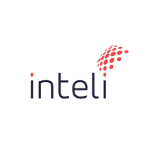

# Inteli - Instituto de Tecnologia e Liderança 

 

# Automação com reconhecimento por voz

## Grupo 5 - Kepler

### 🚀 Integrantes
- <a href="https://www.linkedin.com/in/abner-silva-barbosa-8a3542225/
">Abner Barbosa Silva</a>
- <a href="https://www.linkedin.com/in/daniel-eduardocunha/">Daniel da Silva Cunha</a>
- <a href="https://www.linkedin.com/in/emanuel-45b637185/">Emanuel Costa</a>
- <a href="https://www.linkedin.com/in/gabriel--nascimento/">Gabriel Nascimento</a>
- <a href="https://www.linkedin.com/in/liviapcoutinho/">Livia Coutinho</a>
- <a href="https://www.linkedin.com/in/mateus-neves-3b767123b/">Mateus Neves</a>
- <a href="https://www.linkedin.com/in/priscila-falc%C3%A3o-3435a1244/">Priscila Falcão</a>

## 📜 Descrição

A solução desenvolvida para a IBM busca fornecer uma abordagem inovadora para obter informações atualizadas sobre o que as empresas estão discutindo em relação a tópicos específicos. Através da interação de voz e texto, os usuários podem fazer buscas sobre o que empresas estão dizendo sobre um tema específico, como o que as empresas do ramo financeiro estão falando sobre otimização e planejamento financeiro. Além disso, o motor de IA por trás dessa solução também é capaz de entender o que a IBM e outras empresas de tecnologia estão dizendo sobre o mesmo tema e quais tecnologias da IBM estão relacionadas a ele, proporcionando uma maneira conveniente de acessar insights de mercado, tendências e informações competitivas.

**Principais Recursos:**

- Busca por comandos de voz e texto: É possível a utilização de comandos de voz ou texto para fazer perguntas em linguagem natural, como "O que as empresas do ramo financeiro estão falando sobre otimização e planejamento financeiro?"

- Busca inteligente: A aplicação utiliza tecnologias avançadas de Inteligência Artificial (IA) e Processamento de Linguagem Natural (NLP) para buscar informações relevantes em documentos e fontes confiáveis.

- Resultados abrangentes: Além de informações do mercado em geral, o motor de IA também fornece insights sobre o que a IBM e outras empresas de tecnologia estão dizendo sobre o tema, destacando as tecnologias da IBM envolvidas.

- Interoperabilidade: A solução é compatível com uma variedade de dispositivos e sistemas operacionais, incluindo integração com dispositivos de hardware em diferentes ambientes.

- Privacidade e segurança: A coleta e o uso de dados dos usuários estão em conformidade com as regulamentações de privacidade, garantindo a segurança e a proteção dos dados pessoais.

- Protótipo funcional: A solução é entregue como um protótipo funcional, demonstrando as principais funcionalidades que podem ser refinadas e expandidas conforme necessário.

### Como Começar:

- Clone este repositório.
- Instale as dependências necessárias.
- Execute a aplicação e comece a interagir por voz ou texto.
- Explore os resultados e aproveite os insights obtidos.
 
Este projeto visa melhorar a capacidade de tomada de decisões informadas e manter os profissionais de vendas e clientes da IBM atualizados com informações cruciais sobre o mercado e tópicos relevantes. 

## 📁 Estrutura de pastas

|--> assets 
  &emsp;| --> imagens  
  &emsp;| --> videos  
  &emsp;|--> readme.md 
|--> docs 
  &emsp;| --> apresentação  
  &emsp;| --> outros  
  &emsp;|--> readme.md 
|--> src 
  &emsp;|--> readme.md 
| readme.md 

Dentre os arquivos e pastas presentes na raiz do projeto, definem-se:

- <b>README.md</b>: arquivo que serve como guia e explicação geral sobre o projeto (o mesmo que você está lendo agora).

- <b>assets</b>: aqui estão os arquivos relacionados a parte gráfica do projeto, ou seja, as imagens e links de vídeos que os representam (o logo do grupo pode ser adicionado nesta pasta).

- <b>docs</b>: aqui estão todos os documentos do projeto. Há também uma pasta denominada <b>outros</b> onde estão presentes outros documentos complementares, além de um arquivo README para o grupo registrar a localização de cada artefato.

- <b>src</b>: Todo o código fonte criado para o desenvolvimento do projeto, incluindo backend e frontend se aplicáveis.

src: todo o código fonte criado para o desenvolvimento do projeto, incluindo os blocos de código do circuito, backend e frontend se aplicáveis.

## 🔧 Instalação

Para a instalação desse projeto, é necessário ter alguns recursos instalados na máquina que irá executar. Nota-se que além das instalações necessárias, também destaca-se que é relevante a versão de cada uma dessas tecnologias, haja vista que podem ocorrer falhas na execução, devido a configuração do projeto.

### Tecnologias
- React Native 0.64.2
- Flutter 2.2.3
- Python 3.9.6
- Rabbit MQ 3.9.7
- Docker 20.10.8
- Type Script 4.3.5
- Node 14.17.6
- Serviços IBM Cloud
  - Speech to Text
  - Natural Language Understanding
  - Discovery
  - Watson Assistant

## 🗃 Histórico de lançamentos

**1.0 — 11/08/2023 (Sprint I)**

* Entendimento do Negócio

* Entendimento do Design

* Entendimento da Arquitetura do Sistema

**2.0 — 25/08/2023 (Sprint II)**

* Sistema de NLP

* Documentação da Sprint

**3.0 — 06/09/2023 (Sprint III)**

* Construção do Backend da Solução

* Documentação da Sprint

**4.0 — 22/09/2023 (Sprint IV)**

* Construção do Frontend da Aplicação

* Documentação da Sprint
  

**5.0 — 06/10/2023 (Sprint V)**

* Elaboração da Documentação Final do Projeto

* Apresentação Final

## 📋 Licença/License

<a property="dct:title" rel="cc:attributionURL" href="#">Kepler</a> by <a rel="cc:attributionURL dct:creator" property="cc:attributionName" href="#">Inteli, Abner Silva Barbosa, Daniel da Silva Cunha, Emanuel Costa, Gabriel Nascimento, Livia Coutinho, Mateus Neves, Priscila Falcão</a> is 
licensed under <a href="http://creativecommons.org/licenses/by/4.0/?ref=chooser-v1" target="_blank" rel="license noopener noreferrer" style="display:inline-block;">Attribution 4.0 International</a>

## 🎓 Referências

IBM. Encontre respostas rapidamente com documentos e soluções Cloud. Disponível em: <https://cloud.ibm.com/docs?locale=pt-BR>. Acesso em: set. 2023.

IBM. Speech to text. Disponível em: <https://cloud.ibm.com/apidocs/speech-to-text>. Acesso em: ago. 2023.

ADZLANI, Nasri. RabbitMQ on Docker and python. Disponível em: <https://nasriadzlani.medium.com/rabbitmq-on-docker-and-python-300e449fcc8c>. Acesso em: set. 2023.

PALLETS, Flask. API. Disponível em: <https://flask.palletsprojects.com/en/3.0.x/api/>. Acesso em: set. 2023.

_Alguns textos foram baseados em pesquisas no ChatGPT._ Disponível em: <https://chat.openai.com/>.
