# Inteli - Instituto de Tecnologia e Liderança 

<p align="center">
<a href= "https://www.inteli.edu.br/"></a>
</p>

<br>

# Automação com reconhecimento por voz

**Nome do Projeto:** Automação com reconhecimento por voz

**Nome do Parceiro:** IBM

**Nome do Grupo:** Kepler

**Integrantes do grupo:** Abner Barbosa, Daniel Cunha, Emanuel Costa, Gabriel Nascimento, Livia Coutinho, Mateus Neves, Priscila Falcão.


### **Conteúdo**

- [Visão Geral do Projeto](#visão-geral-do-projeto)
- [Entendimento do Negócio](#entendimento-do-neg%C3%B3cio-sprint-1)
- [Entendimento do Design](#entendimento-do-design-sprint-1)
- [Entendimento da Arquitetura do Sistema](#entendimento-do-design-sprint-1)
- [Documentação da Construção do Backend da Solução](#documentação-da-construção-do-backend-da-solução-sprint-3)
- [Documentação da Construção do Frontend da Solução](#documentação-da-construção-do-frontend-da-solução-sprint-4)
- [Documentação Final do Projeto](#documentação-final-do-projeto-sprint-5)
- [Referências](#referências)
- [Apêndice](#apêndice)


# Visão Geral do Projeto


## Parceiro de Negócios

A IBM (International Business Machines Corporation) é uma empresa multinacional de renome mundial, destacando-se pelo seu vasto legado e liderança na área de tecnologia. Fundada em 1911, a IBM é uma das maiores empresas de tecnologia do mundo, com sede em Armonk, Nova Iorque, EUA. Atuando globalmente, a IBM está presente em uma ampla gama de setores, incluindo tecnologia da informação, computação em nuvem, inteligência artificial, análise de dados, cibersegurança, hardware e software.</br>

A IBM é uma parceira de negócios de grande envergadura, com um histórico notável de inovação e impacto no campo da tecnologia. Seu alcance abrange diversas indústrias, atendendo a setores como finanças, saúde, governo, varejo, manufatura e muitos outros. Graças à sua sólida reputação de qualidade, confiabilidade e compromisso com a pesquisa e desenvolvimento de ponta, a IBM é considerada uma das líderes no mercado de tecnologia global. </br>


## Problema

O problema central é a necessidade de disponibilizar uma solução que permita aos profissionais de vendas da IBM e seus clientes obterem informações atualizadas sobre o que as empresas estão falando sobre tópicos específicos por meio de comandos de voz. A demanda por insights de mercado, tendências e informações competitivas é constante, e a solução visa facilitar a obtenção dessas informações, especialmente para profissionais de vendas que estão sempre em movimento. Portanto, o problema é como criar uma aplicação eficiente que utilize tecnologias avançadas, como IA e NLP, para fornecer resultados precisos e relevantes por meio de interação por voz, mantendo a segurança dos dados e a privacidade do usuário.


## Solução

Nesse sentido, cabe destacar o impacto que a solução proposta terá dentro das áreas da empresa. Trata-se de uma aplicação mobile, que permite o uso de comandos de voz para pesquisas sobre as áreas de vendas e marketing, disponibilizado em versão web e versão aplicativo nativo. A solução busca agregar velocidade e agilidade para os times da empresa usando de tecnologias como a IBM Cloud, além de a tecnologia speech to text também da empresa.

O sistema desenvolvido busca respostas acuradas para cada uma das áreas, proporcionando uma interface de fácil uso que garante pesquisas rápidas e direcionadas. Isso resulta em uma eficiência aprimorada nos processos de vendas e marketing, permitindo uma tomada de decisão mais informada e uma experiência aprimorada para os usuários da aplicação. Além disso, a integração da solução com a IBM Cloud e a tecnologia de reconhecimento de voz exemplifica o compromisso da empresa com a inovação e a busca contínua por maneiras de melhorar suas operações e serviços.

## Objetivos

O projeto do Motor de Inteligência Artificial para Buscas Utilizando Voz para a IBM tem como objetivos centrais:
</br>
</br>
- **Facilitação da aquisição de informações relevantes:** Desenvolver uma aplicação que permita aos profissionais de vendas da IBM e seus clientes obterem informações atualizadas sobre tópicos específicos de maneira rápida e eficiente, eliminando a necessidade de pesquisas manuais demoradas.

- **Melhoria da tomada de decisões:** Capacitar os usuários a tomar decisões mais informadas, baseadas em insights de mercado, tendências e informações competitivas obtidas por meio da aplicação.

- **Aumento do engajamento dos clientes:** A aplicação visa melhorar o engajamento dos clientes da IBM, fornecendo-lhes uma ferramenta valiosa para obter informações relevantes em tempo real.

- **Aplicação por voz e dispositivos móveis:** Desenvolver uma aplicação que permita a interação por comandos de voz, atendendo às necessidades de profissionais de vendas em movimento, além de considerar a integração com outros dispositivos de hardware em diversos ambientes.

- **Utilização de tecnologias IBM:** Utilizar tecnologias avançadas da IBM, como Watson Discovery, Watson Assistant, Watson Studio e Cognos Analytics, para garantir precisão e confiabilidade na busca e análise de informações.

- **Privacidade e segurança:** Garantir que a aplicação colete e utilize os dados dos usuários em conformidade com as regulamentações de privacidade vigentes, mantendo a segurança e proteção dos dados.

- **Entrega de um protótipo Funcional:** Entregar um protótipo funcional que demonstre as principais funcionalidades da aplicação, permitindo sua validação e avaliação pela equipe da IBM.

Esses objetivos orientam o desenvolvimento da solução e fornecem uma direção clara para atender às necessidades dos usuários finais e aos objetivos estratégicos da IBM.

## Partes Interessadas 

No projeto do Motor de Inteligência Artificial para Buscas Utilizando Voz da IBM, diversas partes interessadas desempenham papéis fundamentais para o seu desenvolvimento, implantação e sucesso. Abaixo estão as principais partes interessadas e seus respectivos papéis:

- **IBM:** A IBM é a empresa que está liderando o projeto e é a principal beneficiária da solução. Ela define os objetivos estratégicos, fornece recursos financeiros e humanos, e valida a solução final.
- **Equipe de Desenvolvimento (Alunos do Inteli):** A equipe de desenvolvimento é composta por alunos do curso de Engenharia de Software do Inteli, que desempenham um papel central na criação da aplicação. 
- **Profissionais de Vendas da IBM:** Os profissionais de vendas da IBM são os usuários finais da aplicação. Eles dependem da solução para obter informações relevantes que os ajudem em suas atividades de vendas e no relacionamento com os clientes.
- **Clientes da IBM:** Os clientes da IBM, que podem pertencer a diferentes setores e indústrias, também são beneficiários da solução. Eles têm acesso a informações valiosas por meio da aplicação, o que pode influenciar suas decisões de negócios e estratégias.
- **Equipe de Dados e IA da IBM:** Esta equipe desempenha um papel de apoio crítico, fornecendo expertise em ciência de dados e inteligência artificial para garantir a eficácia da aplicação. Isso inclui cientistas de dados, engenheiros de IA e especialistas em análise de dados.
- **Analistas de Marketing da IBM:** Os analistas de marketing utilizam a aplicação para monitorar tendências de mercado, bem como para coletar informações sobre o que as empresas estão discutindo. Isso influencia as estratégias de marketing e comunicação da IBM.
- **Equipe de Diretoria de Dados e IA da IBM:** A equipe de diretoria de dados e IA fornece orientação estratégica para o projeto e supervisiona a implementação da solução, garantindo que ela esteja alinhada com os objetivos organizacionais mais amplos.
- **Especialistas de Mercado Externo:** Em algumas fases do projeto, especialistas de mercado externos podem ser consultados para garantir a precisão e relevância das informações coletadas pela aplicação.
- **Reguladores e Órgãos de Controle de Dados:** Monitoram a conformidade da aplicação com regulamentações de privacidade e segurança de dados.
- **Equipe de Suporte Técnico:** Responsável por auxiliar os usuários finais, solucionar problemas técnicos e garantir a operação contínua da aplicação.
  
Identificar e compreender as partes interessadas é fundamental para o sucesso do projeto, pois cada uma delas desempenha um papel crucial na concepção, desenvolvimento e uso da solução, incluindo o Inteli e seus alunos, que contribuem significativamente para o desenvolvimento da aplicação.


# Entendimento do Negócio


## Matriz de avaliação de valor Oceano Azul
O propósito da matriz de oceano azul na IBM é auxiliar a organização a identificar oportunidades de mercado ainda não exploradas e a criarem novos domínios de mercado exclusivos para fornecer um valor diferenciado aos seus clientes, impulsionando assim a lucratividade. A empresa pode utilizar a matriz para explorar áreas onde possa inovar sem enfrentar uma concorrência direta, ou em setores onde a concorrência seja limitada, permitindo a descoberta de novas oportunidades. Ao forjar um oceano azul, a IBM pode diminuir a possibilidade de competição e ampliar sua margem de lucro.
<br>

<center>
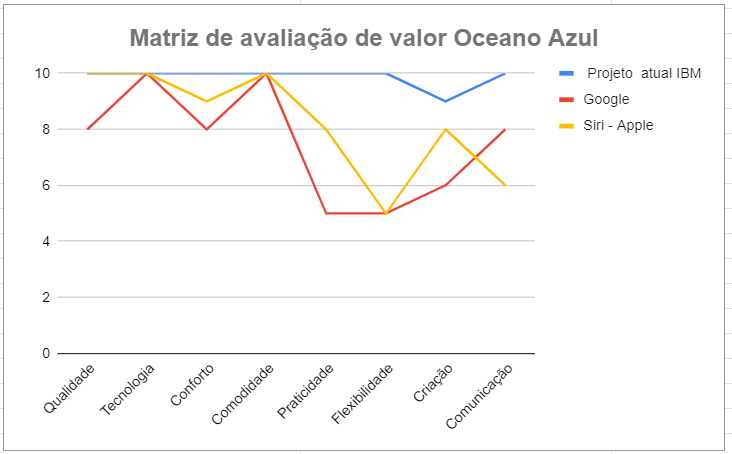
</center>
<a href="https://docs.google.com/spreadsheets/d/1uHQyKkALLHEogL3lve1oep-K8BDoXJzg/edit?usp=sharing&ouid=103941451139893344100&rtpof=true&sd=true"> Clicar aqui. </a>
<br>

### Análise da Indústria

Análise da indústria (Modelo de 5 Forças de Porter) em relação ao cenário da empresa parceira.

### Canvas Proposta de Valor
A Proposta de valor encontrada abaixo foi feita com base nas informações disponíveis no TAPI e na entrevista realizada no dia 4 de agosto para elicitação de requisitos, com base nessas informações foi levantado alguns pontos em relação ao projeto e a IBM que foram utilizados na confecção do Canvas.
<br>

<center>
  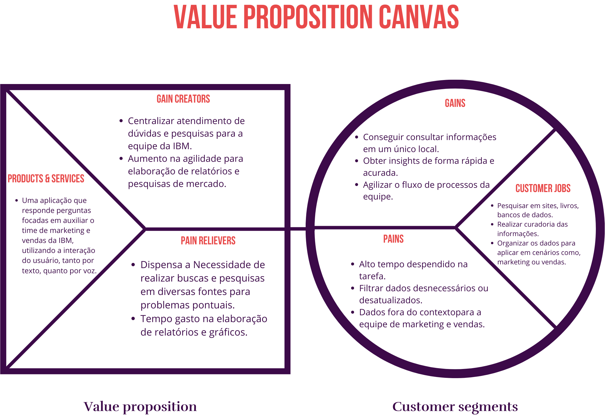
</center>
<br>

### Matriz de Risco


<br>
<p>Uma matriz de risco, também conhecida como matriz de probabilidade e impacto, é uma ferramenta de gerenciamento de riscos amplamente utilizada em várias áreas, como negócios, projetos, segurança, saúde e muito mais. Ela é usada para avaliar e visualizar os riscos potenciais associados a uma ação, decisão ou situação específica. Dessa forma, foi pensada para o projeto:</p>

1) Indisponibilidade do serviço de transcrição
2) Respostas mal formadas pelo modelo
3) Preferência de consulta em comparação às outras I.A's
4) Qualidade ruim do banco de dados
5) Disponibilização de um data lake da IBM
6) Falta de privacidade de alguns dados
7) Utilização de ferramentas de Webcrawling muito boas
8) Exploração de vulnerabilidades do filtro de respostas da I.A.
9) Falhas na captação de áudio
10) Conteúdo perguntado não disponível
11) Tempo de resposta muito longo
12) Falta de entendimento da necessidade do cliente
13) Mudança de escopo do projeto

### Análise Financeira

Nossa análise representa uma estimativa dos custos associados ao desenvolvimento e implementação de um novo aplicativo. Não reflete os custos definitivos que poderão surgir no decorrer do projeto. Atualmente, estamos projetando que 10% dos funcionários da IBM no Brasil, o que dá um total de 1.740 pessoas, venham a utilizar o aplicativo.

A equipe, composta por 5 desenvolvedores, é um dos principais investimentos. Os gastos com esta equipe serão definidos com base nos salários destes profissionais no Brasil, acrescidos de possíveis benefícios que poderão ser concedidos. Outro investimento relevante é a hospedagem. Pretendemos utilizar duas unidades do IBM Virtual server bx2-4x16.

Quanto ao banco de dados, optamos pelo MongoDB devido à sua facilidade de uso e escalabilidade. Vale ressaltar que o MongoDB oferece diferentes faixas de preços, e a opção escolhida influenciará diretamente no custo. Além disso, para a computação serverless, utilizaremos o IBM Cloud Functions. A cobrança deste serviço se baseia no tempo de execução e na quantidade de funções que serão executadas.

Além dos custos mencionados anteriormente podemos destacar mais alguns pontos a serem considerados: 


1. **Novas Oportunidades de Mercado**:
   - A inovação traz a oportunidade de atender a novos mercados ou segmentos de clientes que podem não ter sido explorados anteriormente. Isso pode resultar em aumento de receita à medida que você conquista novos clientes ou expande sua base de usuários.

2. **Modelos de Receita**:
   - A introdução de recursos inovadores no aplicativo pode permitir a adoção de modelos de receita adicionais. Por exemplo, pode-se oferecer assinaturas premium com funcionalidades exclusivas ou monetizar a aplicação por meio de publicidade direcionada.


4. **Feedback e Aperfeiçoamento**:
   - A inovação também pode envolver um processo contínuo de aprimoramento com base no feedback dos usuários. Isso pode resultar em um aplicativo mais atraente e valioso, o que, por sua vez, pode aumentar a fidelidade do cliente e, portanto, a receita.

 Portanto, podemos considerar cuidadosamente como a inovação pode impactar positivamente a receita ao longo do ciclo de vida do seu aplicativo.


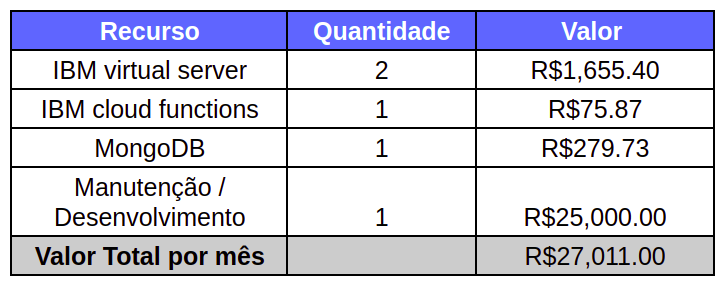


# Entendimento do Design

### Estudo sobre o usuário do sistema

<p>Pensando em delimitar o público específico que a solução iria atender, foi feito um estudo demográfico dentro dos colaboradores da empresa, identificando o perfil que o usuário do sistema teria.</p>

<p>Para essa validação, foi feito uma pesquisa na plataforma LinkedIn, em áreas específicas de Marketing e Vendas. Assim, foi analisado as principais características que apareciam dentro dos perfis da rede, e em seguida, a criação de personas. </p>

<p align="center">Figura x - Persona 1: área de marketing</p>

<br>
<br>
<p align="center">Figura x - Persona 2: área de vendas</p>

<br>

### Experiências que o usuário deverá passar ao utilizar o sistema

<br>
<br>

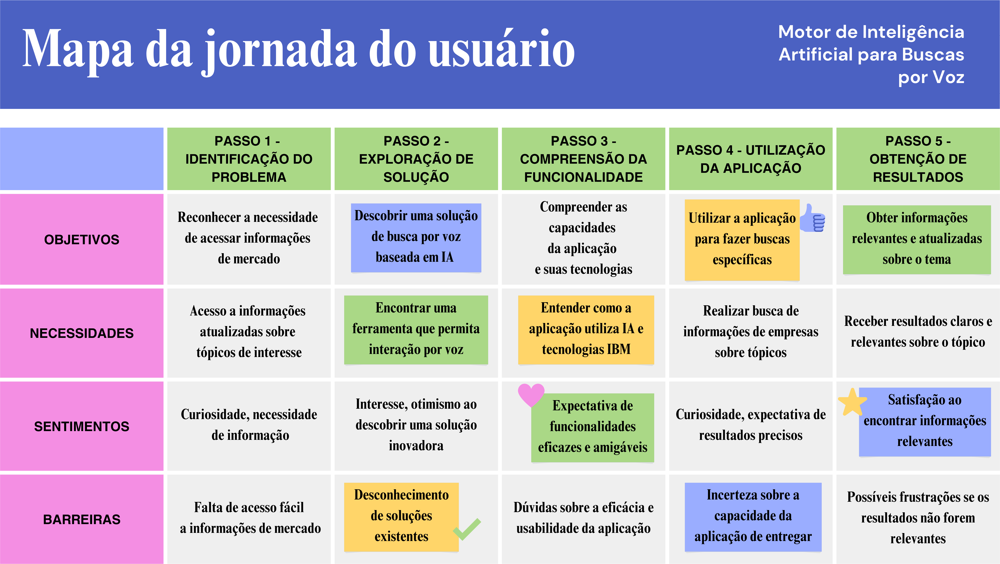

<br>
<br>

***Jornada do Usuário: Explorando o Motor de Inteligência Artificial para Buscas por Voz da IBM***

A jornada do usuário é um mapa essencial que nos guia pela experiência desde o reconhecimento da necessidade até a obtenção dos resultados desejados. Ao seguir os passos delineados na tabela acima, os usuários serão guiados pela trajetória de interação com o Motor de Inteligência Artificial para Buscas por Voz da IBM, uma solução inovadora desenvolvida para oferecer acesso simplificado e eficaz a informações valiosas.
<br>
<br>
- **Passo 1 - Identificação do Problema:**
Neste estágio inicial, os usuários reconhecem a necessidade de acessar informações atualizadas e relevantes sobre tópicos de seu interesse. A curiosidade e a necessidade de informação impulsionam a busca por uma solução que possa atender a essa demanda.

- **Passo 2 - Exploração de Solução:**
Com a necessidade claramente definida, os usuários embarcam em uma jornada de exploração em busca de uma solução adequada. A descoberta do Motor de Inteligência Artificial para Buscas por Voz da IBM desperta o interesse e o otimismo, uma vez que a solução promete uma maneira eficaz e interativa de acessar informações por meio da voz.

- **Passo 3 - Compreensão da Funcionalidade:**
A etapa de compreensão é crucial para os usuários, já que eles procuram entender as capacidades da aplicação e como ela utiliza a Inteligência Artificial e as tecnologias da IBM. Nesse ponto, expectativas de funcionalidades eficazes e amigáveis são criadas, e dúvidas sobre a eficácia e usabilidade da aplicação podem surgir.

- **Passo 4 - Utilização da Aplicação:**
Com uma compreensão sólida, os usuários começam a interagir com a aplicação para realizar buscas específicas por meio de comandos de voz. A curiosidade é novamente estimulada à medida que eles exploram como a aplicação responde e fornece resultados de suas consultas.

- **Passo 5 - Obtenção de Resultados:**
A conclusão da jornada é marcada pela obtenção dos resultados desejados. Os usuários esperam receber informações claras e relevantes sobre o tópico pesquisado. A satisfação surge ao encontrar informações valiosas que podem ser utilizadas para atender às suas necessidades, seja para atualização pessoal ou para enriquecer as atividades de vendas.

**Desafios e Emoções:**
Ao longo de toda a jornada, os usuários podem encontrar desafios, desde a falta de acesso fácil a informações até a incerteza sobre a capacidade da aplicação de entregar resultados relevantes. No entanto, a curiosidade, o interesse e a satisfação impulsionam a experiência, superando possíveis barreiras e incertezas.


***Tabulação testes de usabilidade e conteúdo***

<a href="https://docs.google.com/spreadsheets/d/1g8M77i70M1BZIB-dft7wLKmWZB_4Kfu1/edit?usp=sharing&ouid=103941451139893344100&rtpof=true&sd=true"> Clicar aqui. </a>
<br>

<br><br><br>
### Proposta de UX para o sistema

<p>Pensando na diversidade do cenário para o projeto, pensou-se em uma experiência de usuário personalizada. O foco principal da abordagem é proporcionar uma interação fluida e intuitiva por meio da voz com a aplicação, permitindo aos usuários uma experiência única e cativante. Além disso, a portabilidade da solução é um aspecto fundamental, garantindo que os usuários possam usufruir da aplicação em diferentes dispositivos e ambientes, sem perder a qualidade e a eficiência da interação por voz. </p>

<p>A acessibilidade também é uma preocupação essencial neste projeto, principalmente tendo em vista o público que a aplicação pode abranger, o que permite a aplicação ser inclusiva e acessível a todos os usuários, independentemente de suas capacidades físicas ou limitações.</p>

<p>Dessa forma, para o fluxo do uso da aplicação do usuário foi pensado em uma interface de interação, principalmente com foco em dispositivo mobile. A partir dessa interface, o usuário pode interagir com o sistema desenvolvido pela equipe.</p>

<p> Abaixo é possível verificar as telas da interface do usuário:</p>

<p align="center">Figura x - Tela inicial de carregamento</p>
<p  align="center">
  
</p>

<p>Na primeira tela, como é possível visualizar na imagem acima, temos a tela de carregamento da aplicação. Essa foi pensado para a situação de espera da conexão do sistema com os serviços da IBM. Além disso, também é usada em outras situações, como também o tempo de espera de processamento das perguntas.</p>

<p align="center">Figura x - Tela de captação de áudio</p>
<p  align="center">
  
</p>

<p>Na tela principal da aplicação, o usuário tem a opção de realizar a pesquisa dele por 2 meios: tanto por voz (clicando no botão central de microfone), quanto por texto (caixa de texto abaixo do menu). Além disso, o usuário tem a opção de alterar o foco que o sistema deve ter ao devolver os resultados, isso usando o toggle logo abaixo do ícone de microfone. </p>

<p>Quando o resultado é obtido, o usuário é direcionado para a página com o retorno em texto, além da resposta ser lida em voz alta, com tecnologia text-to-speech, que pode ser silenciada, clicando no botão da parte central superior da tela. Somado a essa funcionalidade, no canto superior direito,  existe o mesmo componente de toggle para alterar o foco do resultado, podendo ser voltado para a área de Marketing e área de Vendas.</p>

<p align="center">Figura x - Tela de resultados para pesquisa do Marketing</p>
<p  align="center">
  
</p>

<p align="center">Figura x - Tela de resultados para pesquisa do Vendas</p>
<p  align="center">
  
</p>

<p> A página de resultados ainda conta com a possibilidade de dar feedbacks quanto a resposta dada pela aplicação, auxiliando assim a melhora do algoritmo do modelo, e também a opção de realizar a pesquisa novamente.</p>

<p>Além disso, assim como em todas as demais telas, a interface contém um menu que permite navegar entre as páginas da aplicação.</p>

<p align="center">Figura x - Modal de menu</p>
<p  align="center">
  
</p>

<p>A aplicação também oferece suporte ao usuário, com perguntas frequentes e contato para ajuda com um atende real.</p>

<p align="center">Figura x - Tela de FAC</p>
<p  align="center">
  
</p>

### Guia de estilo

Para a composição da aplicação, a equipe desenvolvedora fez um guia de estilo para padronizar o design da solução.

<p align="center">Figura x - Tela de FAC</p>
<p  align="center">
  
</p>

### Pilha de tecnologias para implementar a proposta de UX

Nesse tópico estará sendo listados todas as tecnologias que estão previstas para serem utilizadas nesse projeto, pensando tanto em performance e conhecimento do grupo sobre essas ferramentas.

<p  align="center">
  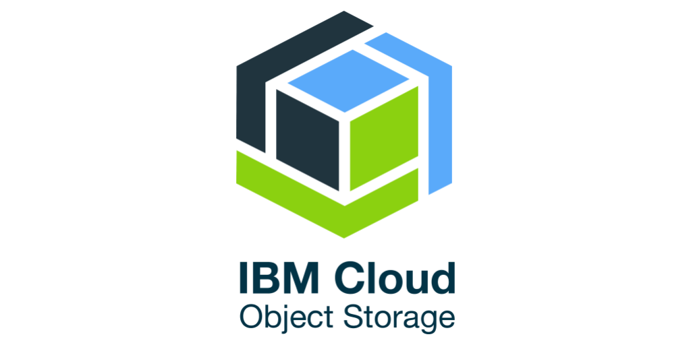
</p>

Este serviço representa uma solução de armazenamento de objetos durável e altamente escalável, que permite o armazenamento e recuperação de dados de forma confiável de qualquer local na Internet.

**Justificativa:**
- Utilizaremos esta ferramenta não apenas para armazenar diversos tipos de dados, como imagens e áudio que foram fornecidos para processamento pela IA, mas também para gerenciar e disponibilizar um site estático.

<br>
<br>

<hr>

<p  align="center">
  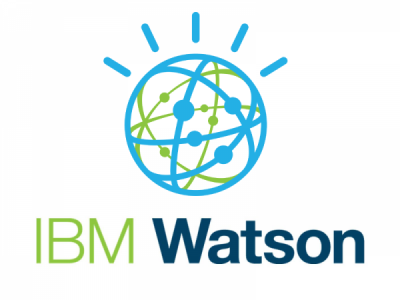
</p>

O IBM Watson Speech to Text é uma ferramenta que utiliza inteligência artificial para transcrever áudio em texto, oferecendo suporte a diversos idiomas e fornecendo recursos avançados de reconhecimento e transcrição de fala.

****************************Justificativa:****************************

- Vamos empregar esta ferramenta para converter os áudios recebidos em texto, uma vez que o modelo de pesquisa que estamos desenvolvendo não possui a capacidade de compreender áudio diretamente. Portanto, é essencial transformar o áudio em texto para que possamos aproveitar a inteligência artificial.

<br>
<br>

<hr>

<p  align="center">
  
</p>

Nest (NestJS) é uma estrutura robusta de desenvolvimento para a criação de aplicativos Node.js, conhecida por sua eficiência e escalabilidade do lado do servidor. Ele usa JavaScript progressivo, é construído com e totalmente compatível com TypeScript embora também seja flexível o suficiente para aqueles que preferem codificar em JavaScript puro. O Nest combina elementos da Programação Orientada a Objetos (OOP), Programação Funcional (FP) e Programação Reativa Funcional (FRP) para oferecer uma base sólida para o desenvolvimento de aplicativos sofisticados e escaláveis.

****************************Justificativa:****************************

- Por motivos de performance e pela busca de desempenho, escalabilidade da aplicação e pela adoção de uma arquitetura orientada para as demandas do mercado.


<br>
<br>

<hr>

<center>

<p  align="center">
  
</p>

</center>

Python é uma linguagem de programação de alto nível, reconhecida por ser interpretada e por oferecer suporte a múltiparadigmas, incluindo programação imperativa, orientada a objetos e funcional. É notável por sua tipagem dinâmica, que permite aos desenvolvedores criar código de maneira flexível, e por sua tipagem forte, que garante uma sólida integridade dos tipos de dados ao longo da execução do programa.

****************************Justificativa:****************************

- Este recurso desempenhará um papel fundamental na construção da nossa IA e também servirá como uma ferramenta valiosa para o processamento de dados, contribuindo para melhorar a experiência do usuário em nossas interações.

<br>
<br>

<hr>

<p  align="center">
  
</p>

React é uma biblioteca JavaScript desenvolvida pelo Facebook, amplamente empregada na criação de aplicativos e websites modernos.

****************************Justificativa:****************************

- Para desenvolver a interface de nossos aplicativos, abrangendo as plataformas IOS, Android e desktop. Além disso, o React simplifica a integração em tempo real com nosso servidor, oferecendo uma solução eficaz e eficiente para atender às necessidades de nossos usuários em diversas plataformas

<br>
<br> 

# Requisitos do Sistema

<p>Requisitos no contexto de desenvolvimento de software referem-se a especificações detalhadas que descrevem as funcionalidades, características e restrições que um sistema ou aplicativo de software deve atender. Esses requisitos são derivados das necessidades dos usuários, das metas do projeto e das expectativas das partes interessadas. Eles fornecem a base para o planejamento, projeto, implementação e teste do software.</p>

Link Sheet: https://docs.google.com/spreadsheets/d/1z1F7-m63oJ9c9-zL6OMIolzFyYjIgCWgDoPbEmJsJQA/edit?usp=sharing

### Requisitos funcionais
<br>
<p  align="center">
  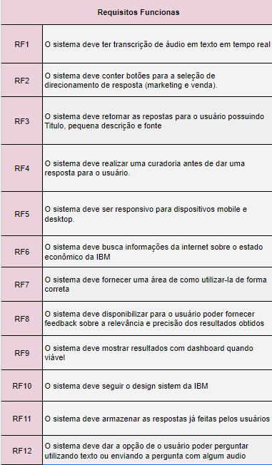
</p>
<br>

### Requisitos não funcionais
<br>
<p  align="center">
  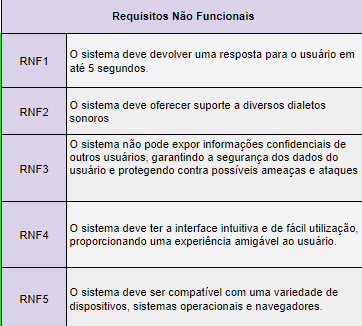
</p>
<br>

### Restrições

<p>Restrição no desenvolvimento de software refere-se a limitações, condições ou restrições específicas que influenciam ou guiam o processo de criação de um programa de computador. Essas restrições podem ser impostas por diversos fatores, como requisitos do cliente, recursos disponíveis, tecnologias empregadas, prazos de entrega, orçamento, questões de segurança, entre outros.</p>

<br>
<p  align="center">
  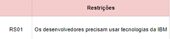
</p>
<br>

### Casos de uso

<p>Caso de Uso é capturar o comportamento requerido do sistema a partir da perspectiva do usuário final na busca de atingir uma ou mais metas desejadas.</p>

<br>
<p  align="center">
  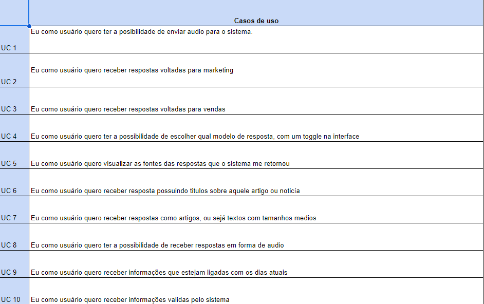
</p>
<p  align="center">
  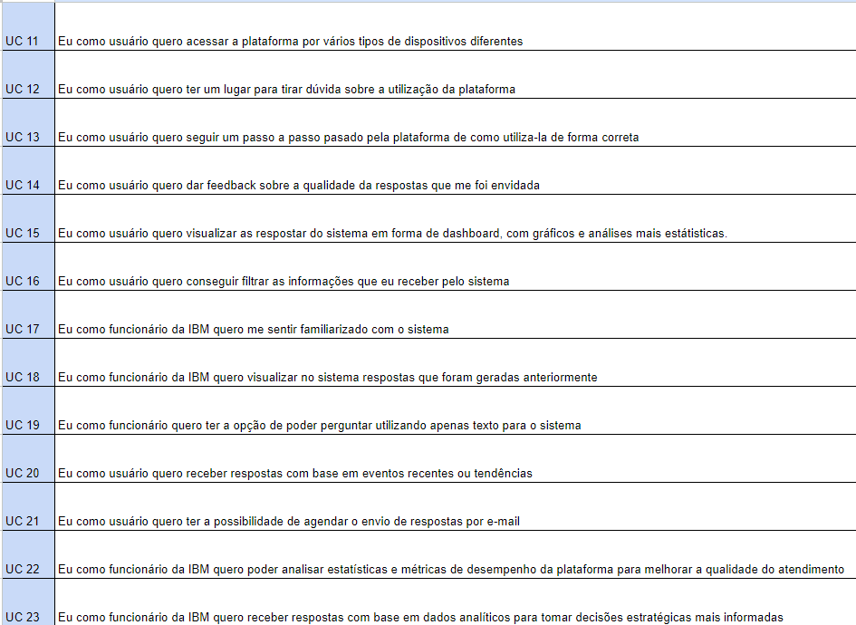
</p>
<br>

### Matriz de rastreabilidade

<p>Uma matriz de rastreabilidade, no contexto de desenvolvimento de software, é uma ferramenta usada para estabelecer uma conexão clara entre os requisitos definidos e as diferentes etapas do processo de desenvolvimento. Ela ajuda a rastrear como cada requisito está relacionado com os componentes do sistema, o design, a implementação e os testes, garantindo que todos os requisitos sejam adequadamente atendidos ao longo do ciclo de vida do projeto</p>

<br>
<p  align="center">
  
</p>
<br>


# Entendimento da Arquitetura do Sistema

<br>
<center>
<p>Figura x - Arquitetura V1</p>
  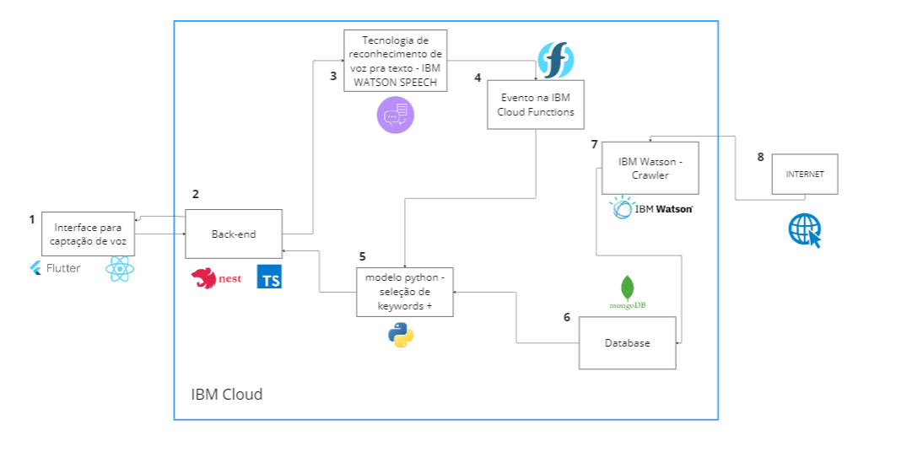
</center>
<br>
<br>
<center>
<p>Figura x - Arquitetura V2</p>
  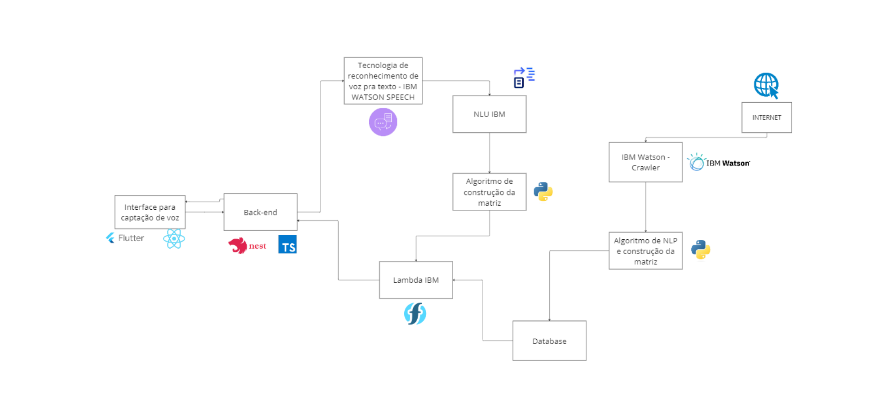
</center>
<br>
<br>
<center>
<p>Figura x - Arquitetura V3</p>
  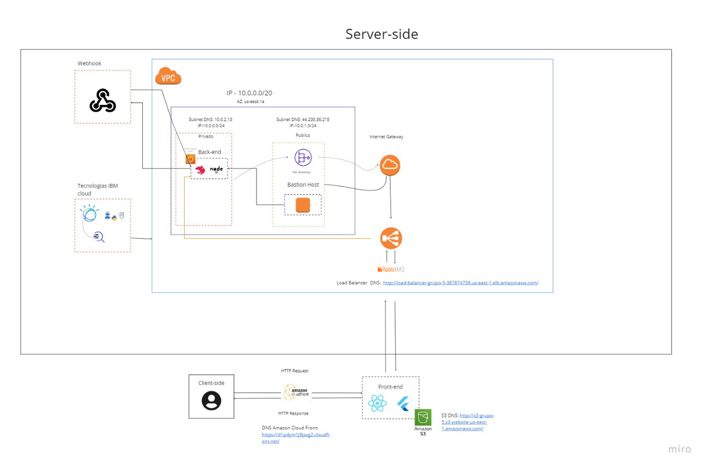
</center>
<br>

Relação entre Arquitetura do Sistema e [Requisitos](#requisitos-do-sistema-sprint-1)

1 - Interface de interação com o usuário, irá atender os seguintes requisitos: RF2,RF5,RF7,RF8,RF9,RF10, RF12 ,RNF4 e RNF5.

2 - Back-end do projeto, irá atender os seguintes requisitos: RF1, RF3, RF9, RF11, RF12 ,RNF1 e RNF3.

3 - IBM Watson Speech to Text, irá atender os seguintes requisitos: RF1, RNF1 e RNF2.

4 - IBM Cloud Functions, irá atender os seguintes requisitos: RF1 e RNF1.

5 - Modelo em python para formular uma resposta para a pergunta, atende os requisitos: RF3, RNF3, RF4, RF8.

6 - Base de dados em MongoDB: RF11.

7 - Ibm Watson Crawler faz a busca dos dados relevantes para a base de dados, atende os requisitos: RF6, RNF3


# Documentação do Sistema NLP

## API para implementar etapa de Speech to Text

<p>Esta API permite que você converta arquivos de áudio em texto de maneira fácil e eficiente. A seguir, apresentamos detalhes sobre como utilizar os endpoints disponíveis, os métodos HTTP aceitos, os parâmetros necessários e exemplos ilustrativos para orientar suas chamadas à API.</p>

<p><strong>Endpoint: </strong>https://api.au-syd.speech-to-text.watson.cloud.ibm.com/instances/e2294ad0-33e5-4582-84b4-7cdaeffc5164/v1/recognize</p>

<p><strong>Método HTTP: </strong>POST </p>

Este endpoint permite enviar arquivos de áudio para serem convertidos em texto.


<a href="https://watson-developer-cloud.github.io/doc-tutorial-downloads/speech-to-text/audio-file.flac">Download Audio.flac</a>

<br>

<strong>Parâmetros de entrada: </strong>

- 'audio_file': Um arquivo de áudio no formato FLAC ou WAV, outros tipos de arquivos de áudio podem ter resultados inesperados e não bem entendidos.

<strong>Exemplos de requisição:</strong>

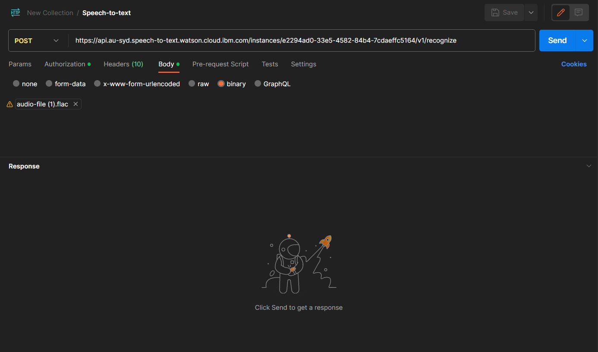

<br>
<br>

<strong>Resultado esperado:</strong>
Após uma chamada bem-sucedida à API, você receberá uma resposta no formato JSON contendo o texto convertido da fala presente no arquivo de áudio.


<br>
<br>

<strong>Aqui em baixo estará disponível a documentação do teste com mais detalhes desse serviço, caso queria fazer alguma utilização desse serviço.</strong>

[Documentação de teste Speech-to-text](https://github.com/2023M7T3-Inteli/Projeto5/blob/developer/tests/speech-to-text/index.md)

<strong>Exemplo de uso:</strong>
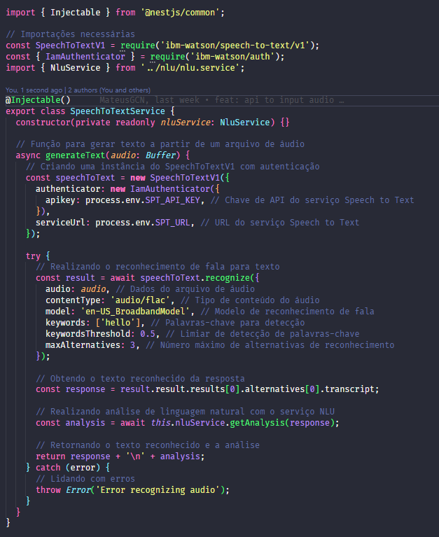


## Algoritmo de NLP utilizado e sua implementação


<p>Processamento de Linguagem Natural (Natural Language Processing) é um campo dentro de inteligência artificial que se concentra na interação entre computadores e linguagem humana. O principal objetivo da NLP é permitir que a compreensão, interpretação e criação de texto ou fala em linguagem natural, por parte de máquinas. </p>

<p>Assim, para o sistema, a equipe desenvolveu algoritmo para o processamento de documentos, artigos e editoriais que seriam retirados da internet por meio da tecnologia da IBM o Watson Crawler a fim de armazená-los, posteriormente, em formato de matriz em um banco de dados. Tem-se como objetivo principal dessa atividade coletar as informações relacionadas a marketing e vendas, com a realização de uma curadoria desses materiais, para retorná-los em pesquisas feitas pelos usuários na interface desenvolvida.</p>

<p>Neste sentido, para a implementação do algoritmo, inicialmente foi necessário a preparação de ambiente, o que incluiu a instalação e importação de algumas bibliotecas, como a nltk, e alguns de seus módulos, como o de tokenização, stemização, lematização, entre outros.</p>

<p>Dessa forma, para processar os dados coletados e gerar seguidamente matrizes correspondentes a esse, o algoritmo foi gerado com o princípio de maior otimização e interpretação dessas informações. Isso refletiu-se nos procedimentos definidos dentro da pipeline de processamento:</p>
<p>
<lu>
<li> Segmentação ou tokenização de frases: pensando que serão processados grande volume de texto, o algoritmo se propõe a segmentar inicialmente as frases presentes, retornando uma array com a separação das mesmas.
<li> Segmentação ou tokenização de palavras: após segmentar as frases, o algoritmo então tokeniza as palavras de cada uma delas, devolvendo novas arrays.
<li> Stemização: a técnica cuja função essencial é promover a indexação de palavras.
<li> Lematização: técnica mais apurada de vetorização que resulta em termos mais precisos, foi usada principalmente para modelar tópicos textuais, eliminando plurais e outras conjugações.
<li> Remoção de stop words: pensando na redução da dimensão da matriz gerada, também ocorre a etapa da remoção de palavras que não agregam tanto para a análise, como artigos, preposições, algumas conjunções, etc.
<li> Classificação: após a obtenção da array com as palavras mais relevantes, essas são classificadas de acordo com as classes gramaticais.
<li> Entidades nomeadas: fase final de processamento antes de transformar em matriz, é o agrupamento das classificações feitas.
</lu>
</p>

<p>É possível verificar todo o código de aplicação, comentado e separado por seção no arquivo: <a src='../src/backend/src/nlp/ALgoritmo_NLP_grupo_5.ipynb'>src/backend/src/nlp/Algoritmo_NLP_grupo_5.ipynb</a><p>


## Processo de deploy do algoritmo em nuvem comercial

<br>

<center>
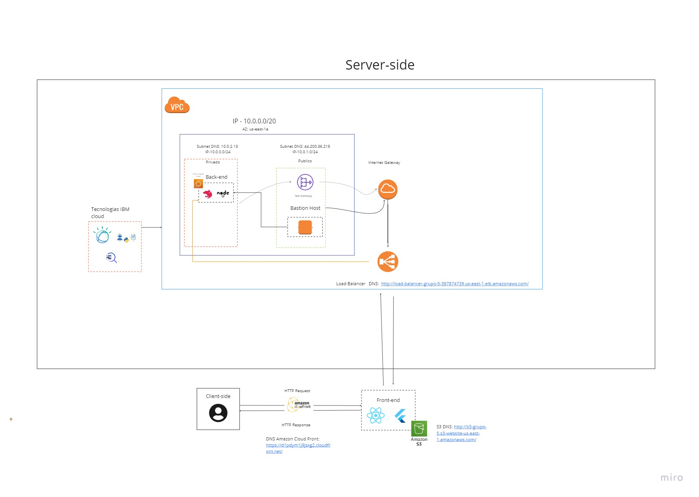
</center>
<a href="https://miro.com/welcomeonboard/c29GdEd2VHNVSTZwSXhjcndPVWNNelV5d0Q0bXhZcGxxUGdLN0dYRUk2YmJmVUNsbUtPRmZ2TzB6WGlDeHh2NXwzNDU4NzY0NTIyMzI3MjA1ODkwfDI=?share_link_id=27034496073"> Clicar aqui. </a>
<br>

## Passos de implantação no IBM Cloud


### Passo 1: Configurar Credenciais de Serviço

1. Acesse o painel de controle da  instância do serviço de Reconhecimento de Fala.
2. Na seção de credenciais, crie uma nova credencial para o aplicativo.
3. Anote as informações da credencial, incluindo a chave de API e a URL do serviço.

### Passo 2: Preparar o Código do Assistente de Voz

1. Certifique-se de que o código do Assistente de Voz esteja pronto para implantação (release https://github.com/2023M7T3-Inteli/Projeto5/releases/tag/v.1.0.0).
2. Certifique-se de que você possui um arquivo `config.json` com as configurações do aplicativo, incluindo as credenciais do serviço de Reconhecimento de Fala.

Referência docker-compose: ../src/docker-compose.yaml

### Passo 4: Implantação no IBM Cloud

1. Abra um terminal.
2. Navegue até o diretório raiz do seu projeto usando o comando `cd`.
3. Inicialize o Git, se ainda não o fez, com o comando `git init`.
4. Conecte o seu projeto ao IBM Cloud usando o IBM Cloud CLI:
   ```
   ibmcloud login
   ```
5. Selecione a organização e espaço onde deseja implantar o Assistente de Voz.
6. Execute o seguinte comando para implantar o aplicativo:
   ```
   ibmcloud app push
   ```
7. O IBM Cloud irá criar uma nova instância da sua aplicação e fazer o deploy do código.

### Passo 5: Acessar o Assistente de Voz

1. Após a implantação bem-sucedida, o Assistente de Voz estará acessível por meio da URL fornecida pelo IBM Cloud.

## API para receber os áudios enviados pelo usuário

<p>Esta API permite que você envie arquivos de áudio para o Backend que utiliza uma biblioteca da IBM cloud que converte o áudio para texto além de também retornar a intenção do texto. A seguir, apresentamos detalhes sobre como utilizar os endpoints disponíveis, os métodos HTTP aceitos, os parâmetros necessários e exemplos ilustrativos para orientar suas chamadas à API.</p>

<p><strong>Endpoint: </strong>https://localhost:3000/upload</p>

<p><strong>Método HTTP: </strong>POST </p>

esta API permite que arquivos de áudio do formato FLAC sejam enviados para o Backend.

<a href="https://watson-developer-cloud.github.io/doc-tutorial-downloads/speech-to-text/audio-file.flac">Download Audio.flac</a>

<br>

<strong>Parâmetros de entrada: </strong>

- 'audio_file': Somente arquivos de áudio no formato FLAC.

<strong>Exemplos de requisição:</strong>

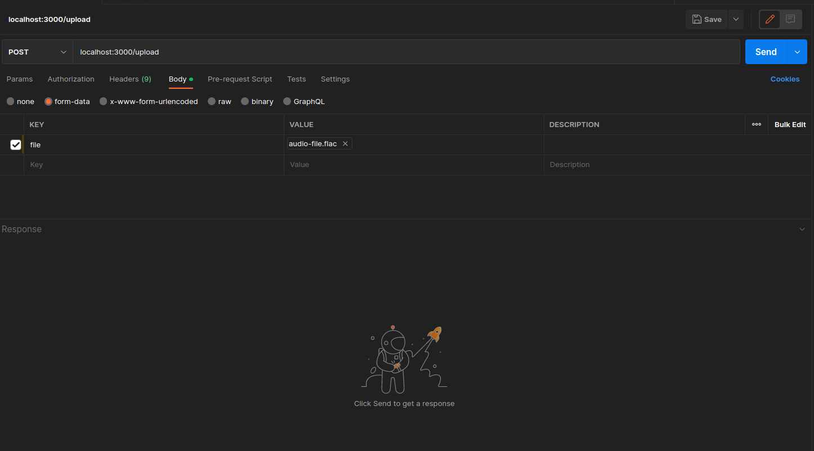

<br>
<br>


<br>
<br>

<strong>Resultado esperado:</strong>
Após uma chamada bem-sucedida à API, você receberá uma resposta no formato JSON contendo o texto convertido da fala presente no arquivo de áudio, sua categoria e suas palavras chave.

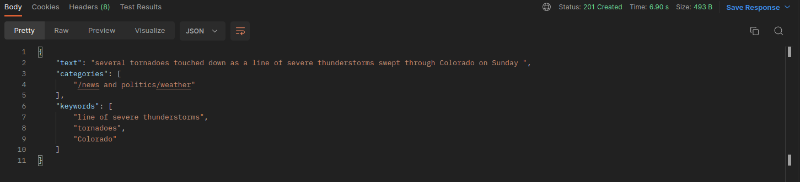

<br>
<br>

<strong>Aqui em baixo estará disponível a documentação do teste com mais detalhes a API</strong>

[Documentação da API para envio de áudio](https://github.com/2023M7T3-Inteli/Projeto5/blob/developer/tests/file-from-user/index.md)


# Documentação da Construção do Backend da Solução
## Backend preparado para receber os Webhooks de processamento de texto
<strong>Resposta ao provedor do webhook:</strong>

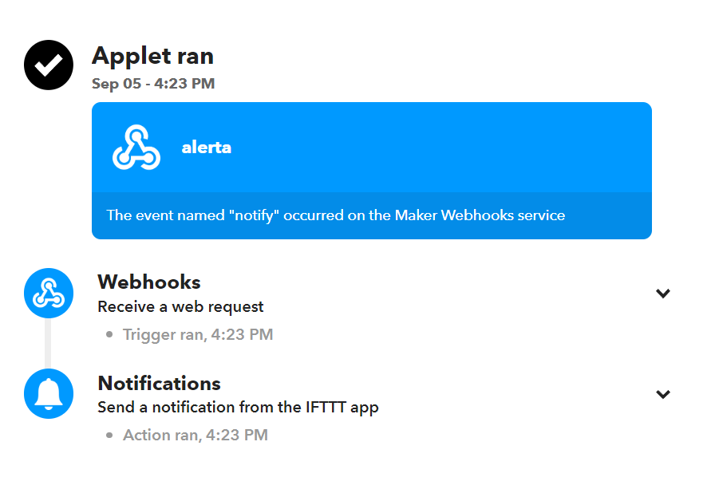

<br>

<p>O webhook permite que nossa aplicação receba notificações e dados em tempo real de um provedor externo por meio de um endpoint específico. Ao receber uma solicitação da web, nossa aplicação processa os dados, executa ações necessárias e envia uma resposta ao provedor do webhook indicando o status do processamento.</p>


## Sistema de troca de mensagens para notificar os eventos

<strong>Rota para alerta</strong>
<br>

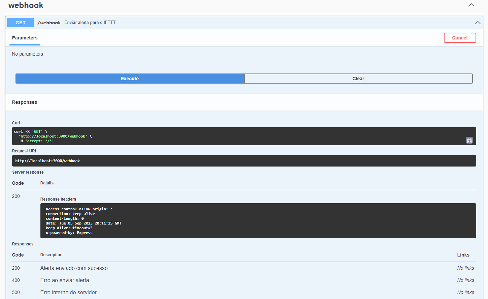
<br>

Essa rota foi configurada para que o backend envie alertas para algum canal de comunicação, no caso documentado acima, ele gera uma notificação no servidor do IFTTT. O cliente deve fazer uma requisição HTTP para a rota "/webhook", para que o alerta seja gerado.
<br>

## Backend preparado para receber os Webhooks de processamento de voz para texto
<strong>Resposta ao provedor do webhook:</strong>


<br>

No momento, o sistema utiliza o mesmo endpoint para receber os webhooks de processamento de texto, e de processamento de voz para texto. Isso torna o backend mais otimizado, fazendo com que seja necessário apenas uma rota para gerar alertas. 
Assim como documentado acima, após o processamento de voz para texto, o cliente deve fazer uma requisição HTTP para a rota "/webhook" para que o alerta seja enviado para o servidor IFTTT.

## Sistema de mensageria - RabbitMQ

<p>Um sistema de mensageria, também conhecido como sistema de mensagens ou sistema de mensageria assíncrona, é uma infraestrutura de software que permite a comunicação assíncrona e distribuída entre diferentes componentes de um sistema de software ou entre sistemas de software distintos. Ele é projetado para enviar, receber, armazenar e encaminhar mensagens (dados) de forma eficiente e confiável, independentemente de os componentes estarem em execução ao mesmo tempo. </p>

<p>Por garantir o funcionamento assíncrono do sistema, entendeu-se que caberia o encaixe na arquitetura de um sistema como esse. Assim, foi escolhida a ferramenta RabbitMQ para atuar como o componente de mensageria da aplicação. Isso porque a ferramenta é um software de mensageria de código aberto altamente confiável e escalável que funciona como um intermediário para transmitir mensagens entre diferentes partes de um sistema distribuído. É amplamente utilizado em arquiteturas de software distribuídas para facilitar a comunicação assíncrona entre aplicativos ou componentes independentes. </p>

<p>Neste sentido, a arquitetura ganha esse componente na fase de pesquisa, com interação direta com o usuário. Foi pensado nessa proposta para que garantisse o funcionamento da aplicação, mesmo com uma alta demanda de uso. Assim, em momentos em que a plataforma estiver sobrecarregada, ainda estará disponível.</p>

<p>Para a implementação do RabbitMQ, foi necessário a instalação da ferramenta, feita por meio de um container do Docker (Figura x). Após a instalação, foi necessário a criação de um arquivo de configuração, que foi feito em formato YAML. Nesse arquivo, foram definidos os parâmetros de configuração do RabbitMQ, como o nome do usuário, a senha, o nome do host, a porta, entre outros (Figura x). </p>

<br>
<center>
<p>Figura x - Container no RabbitMQ</p>
  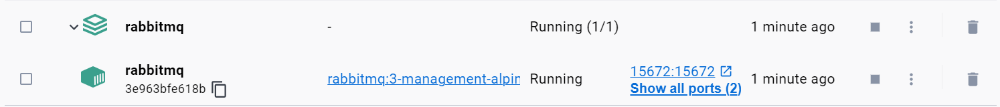
</center>
<br>

<br>
<center>
<p>Figura x - Arquivo yaml de configuração</p>
  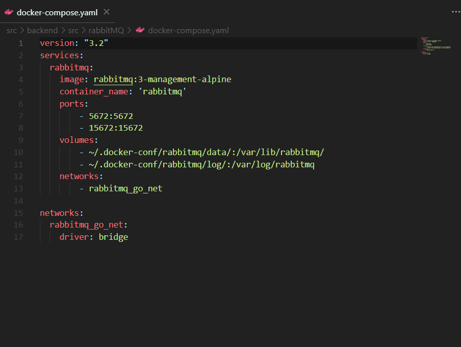
</center>

<p> Posteriormente a configuração, foi possível acessar a interface da ferramenta no endereço "localhost:15672", na qual o usuário é direcionado para uma página de login. Para o acesso, é necessário inserir o nome de usuário e a senha definidas anteriormente no documento de configuração (nesse caso, a palavra "guest" para ambos). </p>

<br>
<center>
<p>Figura x - Página de login RabbitMQ</p>
  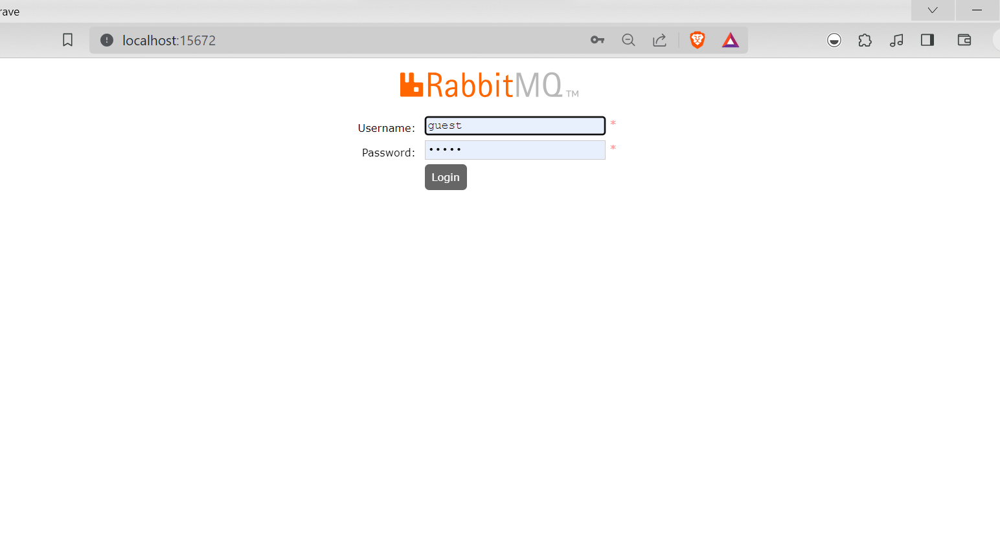
</center>
<br>

<p> Em seguida, foram definidos os produtores, ou seja, os componentes ou aplicativos que geram mensagens e as enviam para o sistema de mensageria,e assim monitorar o envio de mensagens pela interface, além da configuração de tópicos e filas e o desempenho de recebimento da aplicação, conforme a Figura X.</p>


<br>
<center>
<p>Figura x - Mensagens enviadas</p>
  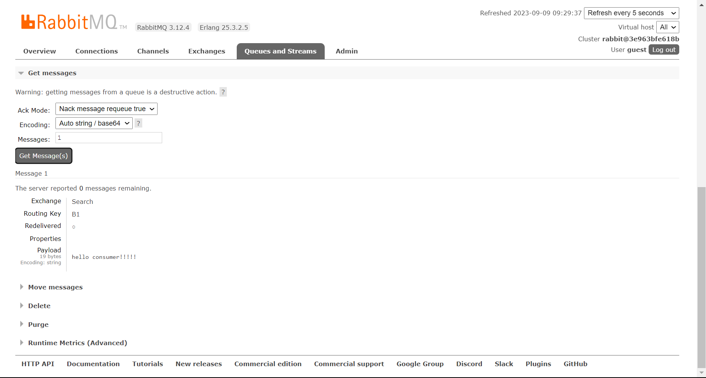
</center>
<br>

<br>
<center>
<p>Figura x - Acompanhamento de desempenho</p>
  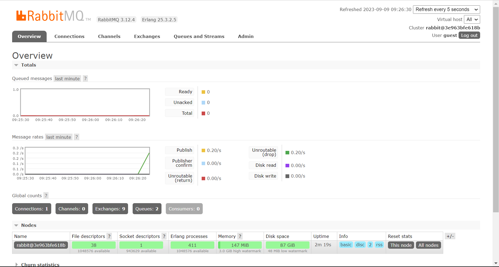
</center>

<br>
<p> Enfim, foram configurados os consumidores, os componentes ou aplicativos que recebem mensagens do sistema de mensageria e as processam de acordo com a lógica de negócios. </p>

<br>
<center>
<p>Figura x - Consumer</p>
  
</center>


## Frontend mínimo para realizar o teste da implementação do modelo

#### Descrição da Interface do Usuário:

<p>A interface do usuário consiste em 3 páginas na web com os seguintes elementos:</p>

<br>

<strong>Por motivos de objetividade da documentação será listados apenas os componentes principais da aplicação, se quiser olhar todos os componentes existentes, só precisa acessar o nosso figma.</strong>

<br>


- Botão de gravar a voz do usuário.
- Botão para enviar o áudio para o servidor.
- Barra de navegação para redirecionar o usuário entre as páginas da aplicação.
- Cards com a resposta do nosso servidor para o usuário.

<p  align="center">
  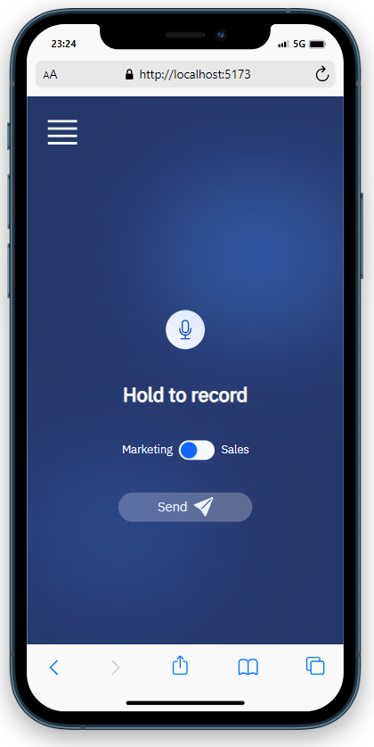

  
</p>

<br>

#### Integração com as APIs do Backend:

<p>O frontend se conecta ao backend por meio de chamadas de API HTTP. Para enviar dados para o backend, usamos uma solicitação POST para a seguinte URL: http://localhost:3000/upload.</p>

<br>

<p>Exemplo de envio de dados de texto para o backend usando Typescript:</P>

<br>

<p  align="center">
  
</p>


#### Instruções de Uso e Testes:

Para testar a implementação do modelo, siga estas etapas:
<br>
- Inicializar o frontend na sua maquina local, utilizando o comando <code>npm run dev</code>
- Clicar no botão de começar a gravar o áudio do seu microfone
- Clicar no botão de enviar o áudio "SEND"
- Aguarde a resposta do backend. Os resultados serão exibidos na área de "Resultados".

Certifique-se de que sua conexão com a internet esteja ativa, e o backend esteja funcionando corretamente, principalmente com variáveis de ambientes necessárias para essa funcionalidade.

https://github.com/2023M7T3-Inteli/Projeto5/assets/99296562/10d526e4-c2ae-47e6-ba74-ba56b607c094


# Documentação da Construção do Frontend da Solução

## Implementação do frontend com o framework ou biblioteca desejada

### 1.1 Requisitos Funcionais e Não Funcionais:

<p>Os requisitos listados a seguir são os que o nosso front-end esta contemplando e pegando como base a construção de novas funcionalidades, deixando assim o nosso projeto com </p>

Requisitos Funcionais:

- (RF2) O sistema deve conter botões para a seleção de direcionamento de resposta (marketing e venda)

- (RF3) O sistema deve retornar as respostas para o usuário possuindo título, descrição e fonte

- (RF5) O sistema deve ser responsivo para dispositivos mobile e desktop.

- (RF7) O sistema deve fornecer uma área de como utilizá-la de forma correta

- (RF12) O sistema deve dar a opção de o usuário poder perguntar utilizando texto ou enviando a pergunta com algum áudio.

Requisitos Não Funcionais:

- (RFN2) O sistema deve oferecer suporte a diversos dialetos sonoros.

- (RNF4) O sistema deve ter a interface intuitiva e de fácil utilização proporcionando uma experiência amigável ao usuário.

- (RNF5) O sistema deve ser compatível com uma variedade de dispositivos, sistemas operacionais (como IOS, Android, Windows e Linux) e navegadores.


### 1.2.1 Wireframes ou Protótipos de Design - React.JS:

<p>Abaixo estarão algumas imagens mostrando a aplicação em react, mostrando as principais funcionalidades e estados da aplicação, lembrando que todo o nosso design esta no nosso Figma onde esta disponibilizado na seção da 1 sprint.</p>

- Home ( Essa tela e aonde tem as principais funcionalidades da aplicação )
- Home (quando esta gravando áudio)
- Result ( Essa tela tem como responsabilidade de mostrar o resultado para o usuário )
- Faq ( Essa tela tem como responsabilidade tirar as dúvidas do usuário que estiver utilizando a aplicação )
- Result (quando ainda não chegou a resposta)

<p  align="center">
  
  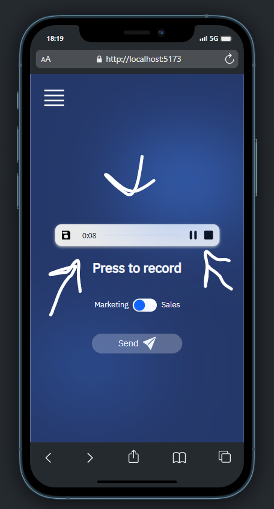
  
  
  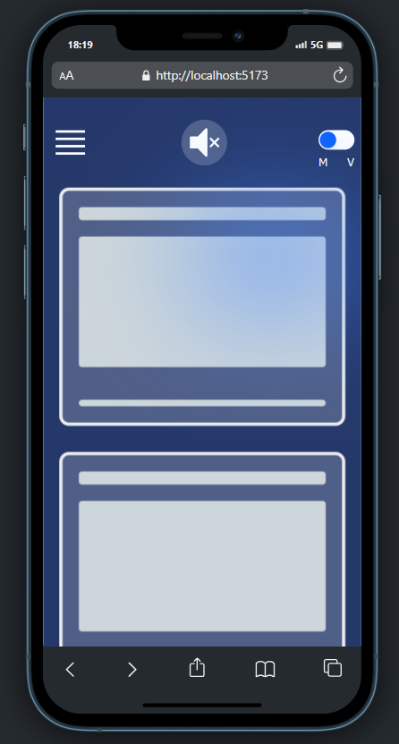
</p>

<p>Abaixo está o fluxo da nossa aplicação no figma por motivos de facilitar a visão da parte de navegação e quais partes estão disponiveis para o usuários.</p>

<p  align="center">
  
  

</p>


### 1.2.2 Ambiente de Desenvolvimento - React:

<p>A nossa aplicação do frontend está sendo feita em React, utilizando Tailwind como biblioteca de estilização.</p>

- Instale o Node.js: https://nodejs.org/, recomenda-se a versão 18.15 pra cima.

- Clonar o repositório <code>git clone url-repo</code>

- Entrar na pasta do front-end react <code>cd src/frontend-react</code>

- Instalar as dependências do projeto utilizando o <code>npm i</code>

- Estando ainda dentro dessa pasta no terminal, rode o comando de inicialização do servidor react local com o comando: <code>npm run dev</code>

- Após isso só é necessário entrar no navegador na url: "http://localhost:5173/", onde entrará na tela inicial da nossa aplicação.

<p>Recomenda-se a versão 18.15 ou maior do node, para conseguir instalar as versões de formas correta de cada biblioteca.</p>

### 1.2.3 Código Fonte do Frontend:

<p>Aqui esta somente a estrutura de pastas, logo muitos arquivos .tsx e .json não estaram aqui, mais a arquitetura da pastas continua a mesmo sendo possivel acessar elas sem problemas.</p>

<p>O código fonte pode ser acessado dentro da pasta "src" do frontend-react</p>

|📂[frontend-react](../src/frontend-react)<br>
&emsp;|📂[public](../src/frontend-react/public)<br>
&emsp;|📂[src](../src/frontend-react/src)<br>
 &emsp; &emsp;|📂[assets](../src/frontend-react/src/assets)<br>
 &emsp; &emsp;|📂[components](../src/frontend-react/src/components)<br>
 &emsp; &emsp;|📂[context](../src/frontend-react/src/context)<br>
 &emsp; &emsp;|📂[pages](../src/frontend-react/src/pages)<br>
 &emsp; &emsp;|📂[scripts](../src/frontend-react/src/scripts)<br>
<br>

<p>Um exemplo de um código da nossa aplicação feita em React com TypeScript</p>

<p  align="center">
  
  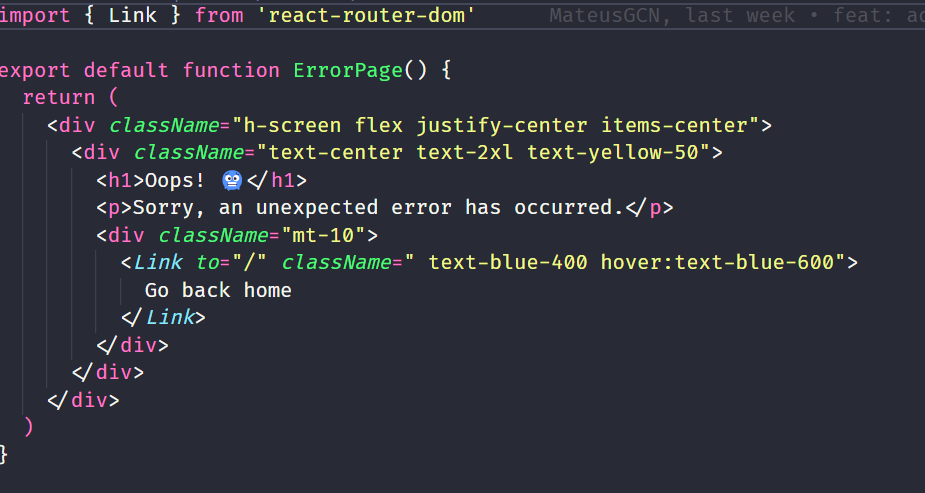

</p>


## Testes do frontend implementado

Testes de Unidade:
- Estratégia: Utilizar ferramentas como Jest para testar componentes e funções individualmente.
- Objetivo: Garantir que cada parte do código do frontend funcione corretamente isoladamente.

Testes de Integração:
- Estratégia: Integração de diferentes componentes e módulos do frontend, não conectado diretamente ainda com o backend.
- Objetivo: Verificar a funcionalidade correta quando vários componentes interagem entre si.
  
Testes de Interface do Usuário (UI):
- Estratégia: Utilizar ferramentas como Cypress para simular interações do usuário, ou pesquisa direta com outros usuário sobre a UI.
- Objetivo: Certificar-se de que a interface do usuário está funcionando conforme o design e as interações esperadas.
  
Testes de Desempenho:
- Estratégia: Utilizar ferramentas como Lighthouse para avaliar o desempenho da aplicação.
- Objetivo: Garantir que a aplicação atenda aos requisitos de desempenho, incluindo tempo de carregamento e responsividade.
  

### 1.3.1 Wireframes ou Protótipos de Design - Flutter:

Assim como citado anteriormente na corrente documentação, a aplicação também foi desenvolvida em Flutter, para permitir que o usuário tenha acesso ao sistema por meio de um aplicativo mobile. A seguir, estão listadas as telas desenvolvidas para o aplicativo, com seus respectivos elementos e funcionalidades.
- Home: tela inicial do aplicativo, com os botões para gravar a pergunta.
- Pop-up de confirmação: tela que aparece após o usuário clicar e soltar o botão de gravar, para confirmar se deseja enviar a pergunta, dando a opção de cancelar o envio.
- Resultado: tela que exibe a resposta do sistema para a pergunta feita pelo usuário.
- FAQ: contém as perguntas mais frequentes feitas pelo usuário em relação ao sistema e suas respectivas respostas. Além disso, também contém o contato para suporte, caso a dúvida não seja sanada.

<p  align="center">
  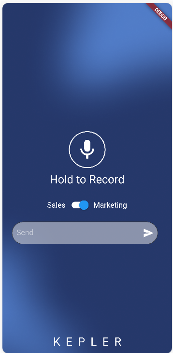
  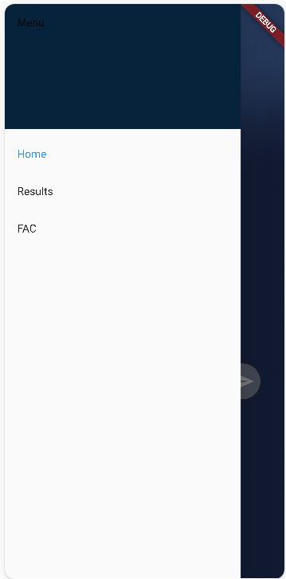
</p>
<p  align="center">
  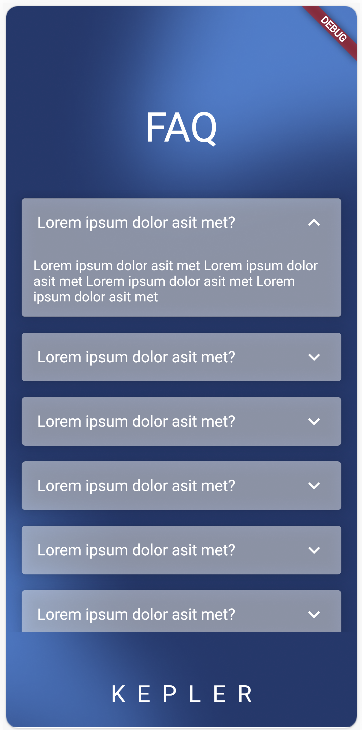
</p>


### 1.3.2 Ambiente de Desenvolvimento - Flutter:

<p>Para a execução da aplicação em flutter, no ambiente de desenvolvimento, é necessária a execução de alguns passos e aquisição de alguns recursos.</p>

<p>Inicialmente, vale destacar que é necessário o download de Flutter e da linguagem Dart (linguagem na qual o Flutter é feito).</p>

<p>O download pode ser feito no link: <a src= 'https://docs.flutter.dev/get-started/install'>https://docs.flutter.dev/get-started/install</a></p>

<p>Em seguida, é preciso fazer o clone do atual repositório, para ter acesso ao projeto e assim conseguir executá-lo.</p>

<p>No diretório<code> src/front-end/flutter</code>, é possível encontrar o arquivo <code>pubspec.yaml</code>, que contém todas as dependências necessárias para a execução do projeto. Para instalá-las, basta executar o comando: <code>flutter pub get</code></p>

<p>Em seguida, é necessário apenas necessário se direcionar para o arquivo <code>main.dart</code> e iniciá-lo, lembrando de selecionar anteriormente qual o dispositivo deseja visualizar.</p>

### 1.3.3 Testes appium -Flutter:

<p>Para a a execução  dos testes em appium, é necessário buildar um apk do Flutter e colocar em uma pastar chamada APK dentro da pasta de appium-flutter, o apk não está disponível no github pois ele excedeu o tamanho limite que o github permitia subir de arquivo.</p>

<p>Também é necessário ter o appium server instalado na máquina e online na porta 4723.</p>

<p>Dentro da pasta appium-flutter, use o código: <code>npm i</code> para baixar as bibliotecas necessárias.</p>

<p>Para execução dos testes também é necessário ter um emulador de android, onde será reproduzido o teste automatizado do APK.</p>

<p>Quando o Appium e o emulador estiverem online, basta utilizar o código : <code>npx wdio wdio.conf.js</code></p>

<p  align="center">
  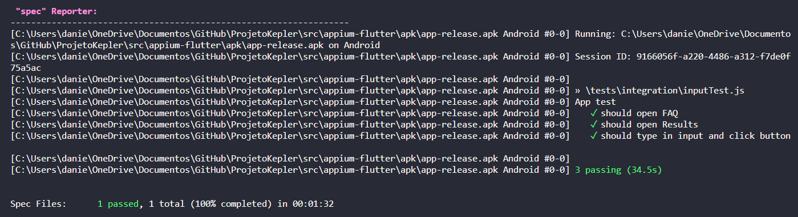
</p>


### 2.2 Casos de Teste

Testes de Unidade:

- Caso de teste para função de enviar texto:
Entrada: Texto com a pergunta em forma de string
Resultado Esperado: Um array de vários strings [ "asdas", "asdsda,] onde cada index representa uma resposta diferente. 

Passos:
- Entrar no projeto do frontend <code>cd src/frontend-react</code>
- Instalar as dependencias <code>npm i</code>, recomenda-se a versão 18.15 do node.
- Executar o comando no terminal para executar os testes <code>npm run test</code>
- É possivel também realizar esses testes de forma manual ná propria aplicação.

Testes de Integração:

- Caso de teste para integração entre retorno de respostas e a renderização do componentes com as repostas.
Entrada: Texto com a pergunta em forma de string ou um áudio em portugues que esteja no src/audio/ em portugues com o nome audioTest.flac
Resultado Esperado: Um array de vários strings [ "asdas", "asdsda,] onde cada index representa uma resposta diferente, exemplo abaixo:

<p  align="center">
  
  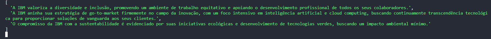

</p>

<br>

Passos:

<p>Nesse caso é necessário que acha um arquivo de áudio em portugues na pasta src/test/audio, pois será esse áudio que será usado como teste para resposta</p>

<br>

- Entrar no projeto do frontend <code>cd src/frontend-react</code>
- Instalar as dependencias <code>npm i</code>, recomenda-se a versão 18.15 do node.
- Executar o comando no terminal para executar os testes <code>npm run test</code>
- É possivel também realizar esses testes de forma manual ná propria aplicação.

Testes de Interface do Usuário (UI):

- Caso de teste para compreender e verificar se a nossa aplicação está acessível e com uma boa usabilidade para o usuário:
  
Link abaixo para um documento onde temos documentado todo o processo e etapas que utilizamos para esse caso de uso:
  https://docs.google.com/spreadsheets/d/1g8M77i70M1BZIB-dft7wLKmWZB_4Kfu1/edit?usp=sharing&ouid=102944795941725922945&rtpof=true&sd=true

  
### 2.3 Relatórios de Teste

Testes de Unidade:
- Resultados: Todos os testes de unidade passaram conforme esperado.
- Problemas: Nenhum problema encontrado.
  
Testes de Integração:
- Resultados: Todos os testes de integração passaram conforme esperado.
- Problemas: Nenhum problema encontrado.
  
Testes de Interface do Usuário (UI):
- Resultados: A maioria dos testes de interface do usuário passou, alguns casos de teste falharam devido a elementos não encontrados.
- Problemas: Necessidade de ajustes na seletor de alguns elementos na interface do usuário.

## Integração do frontend com o backend implementado

### 3.1 Documentação da Integração
Instruções para Integração:

Chamadas à API:

As chamadas à API do backend devem seguir o formato: 
- http://localhost:3000/upload -> Para enviar áudio
- http://localhost:3000/upload/text -> Para enviar um texto
  
Utilize os métodos HTTP apropriados (POST) para interagir com os recursos.

Enviar o áudio do frontend para o backend:

Para enviar o áudio, é necessário se ter um áudio em formato .webm e também enviar um parâmetro com o content-type com o formato que esta sendo enviado o áudio, um exemplo do código abaixo:

<p  align="center">
  
  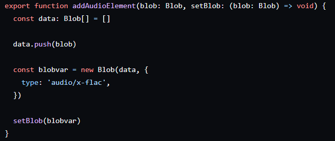

</p>

<hr>

<p  align="center">
  
  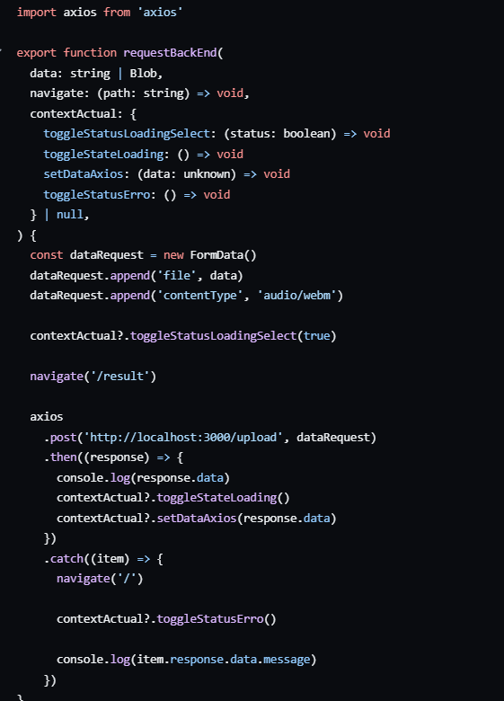


</p>

O backend retorna códigos de status HTTP para indicar o resultado da requisição.


Os possíveis códigos de erro e suas mensagens estão documentados no swagger da nossa API.


### 3.2 Testes de Integração

<p><stong>Antes de iniciar os testes é necessário que esteja o backend (nest) rodando na porta 3000 e a api em flask</stong>, pois sem esses serviços rodando em um ambiente mesmo que pequeno ou em containers, não sera possivel realizar esses testes.</p>
- Node >= 18.15
- Python3

Testes Específicos:

Objetivo: Verificar se a comunicação entre o backend e o frontend estão dando certas
Passos: <code>npm run test</code>

<p  align="center">
  
  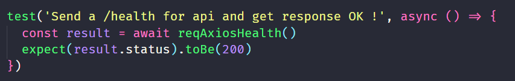
</p>

Objetivo: Certificar-se de que tanto a nossa aplicação e o nosso backend bloquei a entrega ou comunicação entre os dois caso o arquivov de áudio não seja enviado
Passos: <code>npm run test</code>

<p  align="center">
  
  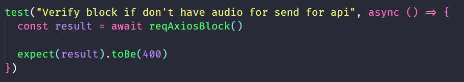
</p>

Objetivo: Testar a resposta via texto enviado para o backend e retornando com um determinado valor do proprio modelo para o frontend
Passos: <code>npm run test</code>

<p  align="center">
  
  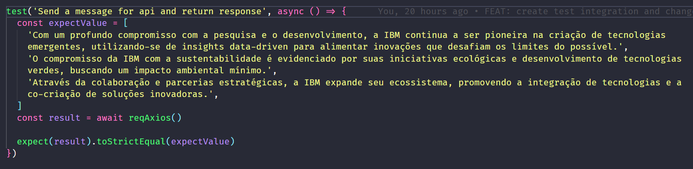
</p>

<p>Terminal com os logs do testes</p>

<p  align="center">
  
<p  align="center">
  
  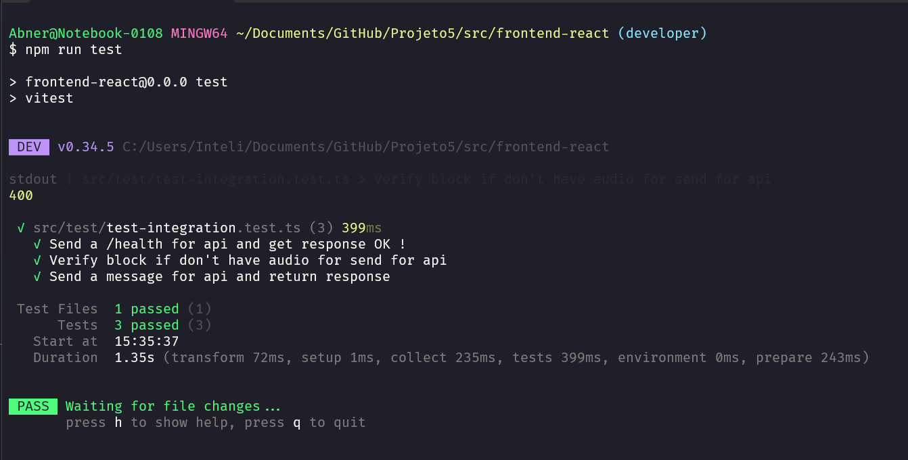
</p>

</p>


## Deploy da solução

### Deploy backend

O deploy do backend foi feito na plataforma AWS, utilizando o serviço EC2, as instruções a seguir são para a replicação do deploy em uma máquina Ubuntu.

1 - Clonar o repositório do projeto na máquina virtual:

<code>git clone https://github.com/2023M7T3-Inteli/Projeto5.git</code>

2 - Instalar nodejs utilizando nvm:

O tutorial para fazer a instalação do nvm pode ser encontrado no link: https://github.com/nvm-sh/nvm . Após a instalação do nvm, é necessário colocar o nodejs na versão 18, para isso, basta rodar o comando:

<code>nvm install 18</code>

3 - Instalar as dependências do projeto:
Entre na pasta na pasta <code>/Projeto5/src/backend</code> e rode o comando:

<code>npm install</code>

4 - Instalar pm2:

<code>npm install pm2 -g</code>

5 - Iniciar o servidor via pm2:

Para que o servidor não pare de rodar, mesmo após o fechamento do terminal, é necessário iniciar o servidor utilizando o pm2, para isso, é necessário entrar na pasta <code>/Projeto5/src/backend</code> basta rodar o comando:

<code>pm2 start "npm run start"</code>

### Testes backend

Testes unitários podem ser feitos para verificar se todas as rotas estão funcionando da maneira como deveriam. Para rodar os testes do backend, é necessário entrar na pasta <code>/Projeto5/src/backend</code> e rodar o comando:

<code>npm run test</code>

### Testes de produção

Nos testes de produção, podemos validar o funcionamento da API em produção, após o deploy. A aba de "target group" na AWS, mostra o status de cada instância, e podemos verificar se a API está funcionando corretamente, ou se está com algum erro.

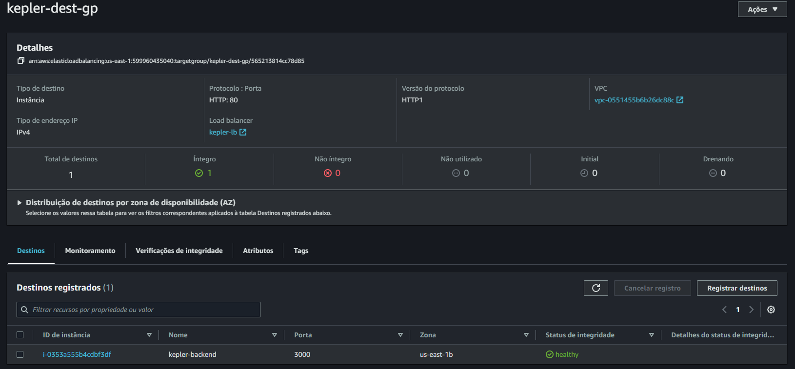

<br>

No caso acima, a API está funcionando corretamente, e o status é "healthy". Esse teste também valida o funcionamento do balanceador de carga.

<br>

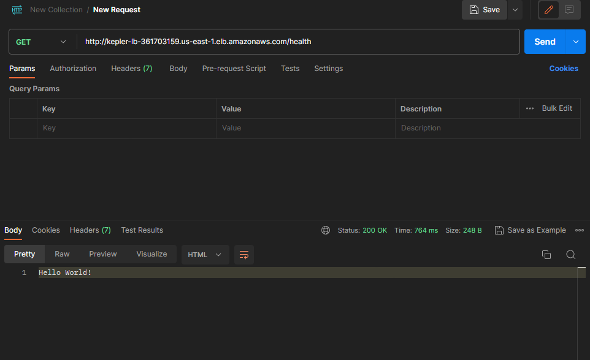

<br>

A imagem acima também demonstra que a aplicação está funcionando como deveria, retornando "Hello World" para a requisição GET na rota "/health".
## Deploy do Frontend no Amazon S3

### Pré-requisitos
1. **Criar conta AWS**.
2. **AWS CLI**: Ter a AWS CLI instalada.

### Configuração Inicial
1. **Criar um Bucket S3**: Crie um novo bucket S3 para hospedar seu frontend. Escolha um nome único globalmente e lembre-se de que ele deve ser único em toda a AWS.

   ```sh
   aws s3 mb s3://seu-bucket-nome
   ```

2. **Configurar Política de Bucket**: Defina as políticas de acesso público ou privado ao seu bucket, dependendo dos requisitos de segurança.

### Preparação do Frontend
1. **Build do Frontend**: Certifique-se de que seu aplicativo frontend esteja pronto para implantação e construa-o, se necessário.

   ```sh
   npm run build
   ```

2. **Pasta de Distribuição**: Após a construção, sua pasta de distribuição será criada (por exemplo, `build/`).

### Implantação do Frontend
1. **Carregar Arquivos no Bucket S3**: Faça o upload dos arquivos da pasta de distribuição para o bucket S3.

   ```sh
   aws s3 cp --recursive ./build/ s3://seu-bucket-nome/
   ```

2. **Configurar Acesso Público (Opcional)**: Caso deseje que o frontend seja acessível publicamente, configuremos as permissões para tornar os arquivos públicos.

   ```sh
   aws s3 website s3://seu-bucket-nome/ --index-document index.html
   ```

3. **Configurar Política de Bucket (Opcional)**: Atualize as políticas de bucket para permitir ou restringir o acesso apropriado.

### Testar o Frontend
1. **Obter o URL**: A URL pública do  frontend na seção "Propriedades" do  bucket S3 no Console da AWS.

2. **Testar no Navegador**: A URL do  frontend no navegador para garantir que ele esteja funcionando corretamente.

### Atualizações do Frontend
- Sempre que  fizer alterações no  frontend, repita as etapas de construção e implantação para atualizar a versão no Amazon S3.

### Considerações de Segurança
- Certifique-se de configurar as políticas de bucket e permissões de acesso de acordo com as melhores práticas de segurança.
- Evite armazenar informações confidenciais diretamente no bucket S3 público.


# Documentação Final do Projeto (Sprint 5)

Preencher seguindo as orientações da Adalove.

A documentação final deve conter:

- Componentes e tecnologias utilizados;
- Custo de implementação da prova de conceito e estimativa de custo para a solução final;
- Análise financeira do projeto;
- Funcionalidades implementadas na prova de conceito;
- Benefícios entregues pelo projeto;
- Aperfeiçoamentos futuros possíveis para o projeto;
- Revisão da visão geral do sistema (arquitetura da integração).

Referencie as revisões e melhorias realizadas nos itens acima.

# Referências

IBM. Encontre respostas rapidamente com documentos e soluções Cloud. Disponível em: <https://cloud.ibm.com/docs?locale=pt-BR>. Acesso em: set. 2023.

IBM. Speech to text. Disponível em: <https://cloud.ibm.com/apidocs/speech-to-text>. Acesso em: ago. 2023.


ADZLANI, Nasri. RabbitMQ on Docker and python. Disponível em: <https://nasriadzlani.medium.com/rabbitmq-on-docker-and-python-300e449fcc8c>. Acesso em: set. 2023.

PALLETS, Flask. API. Disponível em: <https://flask.palletsprojects.com/en/3.0.x/api/>. Acesso em: set. 2023.

_Alguns textos foram baseados em pesquisas no ChatGPT._ Disponível em: <https://chat.openai.com/>.

# Apêndice 

Os apêndices representam informações adicionais que não caberiam no documento exposto acima, mas que são importantes por alguma razão específica do projeto. 
