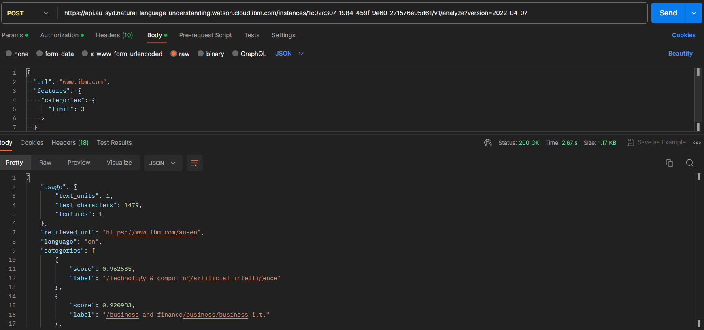

Neste diretório, devem ser inseridos os testes do projeto.

Alguns exemplos são fornecidos a seguir:

## Testes Unitários NLP

Foram realizados testes com a API do serviço da IBM: Watson Natural Language Understanding (NLU). Para esse teste, o NLU deveria ler o site da IBM, analisá-lo, e analisar em que categorias o texto se encaixa, neste caso, três categorias. As categorias foram: "Tecnologia e computação/ Inteligência artificial", "Negócios e finanças" e "Tecnologia e computação" novamente.  

Pré-condições de teste: Baseado na <a href="https://cloud.ibm.com/apidocs/natural-language-understanding">Introdução da IBM <a/>sobre o serviço de processamento de linguagem natural, é necessário realizar uma chamada HTTP com o método POST, utilizando a chave de API disponibilizada, com a url da API, e usando os parâmetros mostrados na imagem, em formatação JSON.

 

  

 

Pós-condições de teste: Era esperado que o serviço retornasse uma análise de categorias onde o valor do parâmetro "url" se encaixasse. Nesse caso, foi o resultado esperado, pois foi feita a analise do site da IBM, que é uma empresa de tecnologia voltada para negócios. 

- Teste Unitário;
- Teste de Integração;
- Teste de Regressão;
- Teste de Usabilidade.
