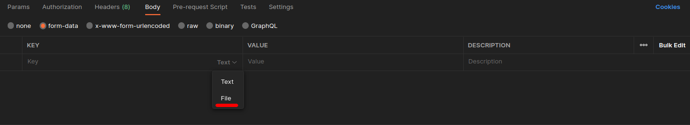
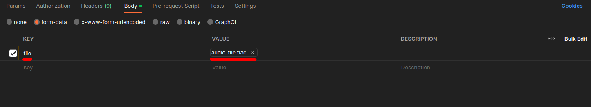
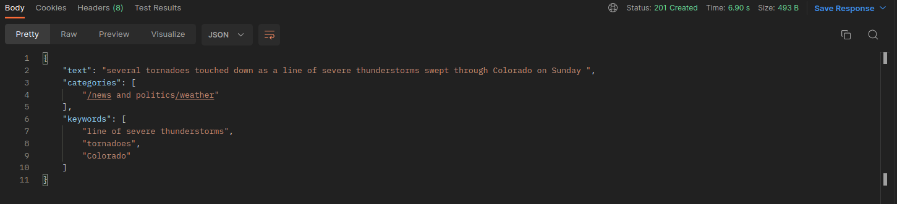

# Teste API para receber os áudios enviados pelo usuário

Esse arquivo serve para demostrar a forma de testar a API para receber os áudios enviados pelo usuário

## 🔧 Configurações

Nesse caso estaremos utilizando o postman para fazer a requisição para a API, onde ela está esperando os seguintes dados

<strong>Método</strong>: POST

<strong>URL:</strong> https://localhost:3000/upload

 
 

<strong>Body:</strong>

Abaixo está o link do audio para download. <strong>Recomendamos que utilize esse audio, pois sabemos a forma correta de retorno de resposta dele.</strong>

<a href="https://watson-developer-cloud.github.io/doc-tutorial-downloads/speech-to-text/audio-file.flac">Download Audio.flac</a>

Após baixar o arquivo, você deve colocar ele no body da requisição no postman, como demostrando a seguir: 

 
 

## 🚀 Iniciar teste

Após realizar todas essas etapas, o postman já estará pronto para realizar o teste, onde no final estaremos esperando retornar esse resultado: 

Video demo:

https://github.com/2023M7T3-Inteli/Projeto5/assets/99264712/433e5153-5179-47e3-a777-204fa78ab242

<strong>Pós-condições de teste</strong>: Era esperado que o serviço retornasse o audio transcrito para texto e a intenção do texto. Nesse caso, foi o resultado esperado.

