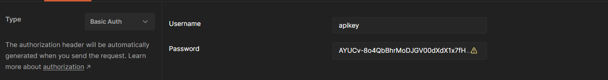
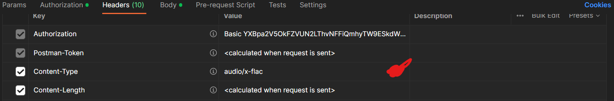
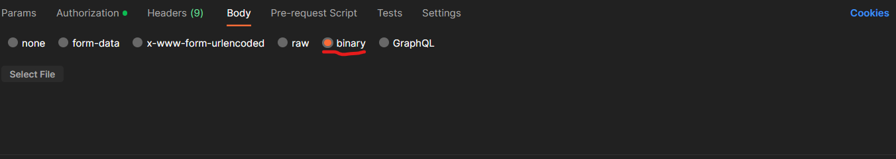
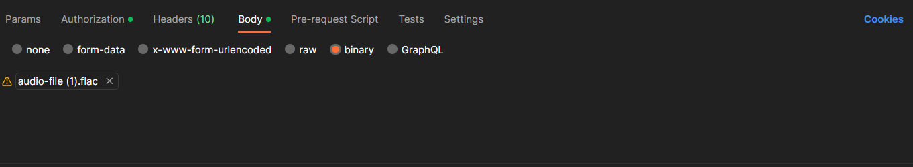
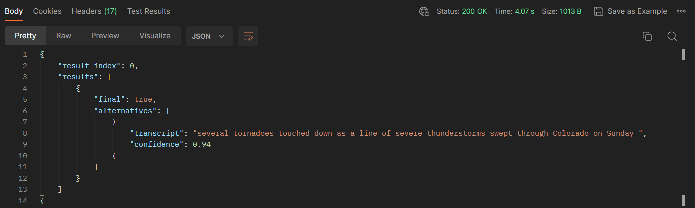

# Teste IBM  Speech to Text

Esse arquivo serve para demostrar a forma de testar a funcionalidade do Speech to text do serviço da IBM

 

<strong>Pré-condições de teste</strong>: Baseado na Introdução da IBM sobre o serviço de processamento de transformar audio em texto, é necessário realizar uma chamada HTTP com o método POST, utilizando a chave de API disponibilizada, com a url da API, e usando os parâmetros mostrados na imagem, em formatação JSON.

## 🔧 Configurações

Nesse caso estaremos utilizando o postman para fazer a requisição para o serviço da IBM, onde ele está esperando os seguintes dados

<strong>Método</strong>: POST

<strong>URL:</strong> https://api.au-syd.speech-to-text.watson.cloud.ibm.com/instances/e2294ad0-33e5-4582-84b4-7cdaeffc5164/v1/recognize

<strong>Authorization:</strong>

- 
<strong>Username:</strong> apikey

- 
<strong>Password:</strong> Possível conseguir no serviço da IBM cloud 

 

Nesse caso criamos esse serviço para funcionalidade de testes, logo tem change para quando for para produção, seja outras informações de autorização.

 

Exemplo de como usar:

 
 

<strong>Headers:</strong>

Nesse teste nós estamos definindo uma propriedade ( Content-Type ) para mandar para a requisição entender que estamos enviando um arquivo .flac

- 
As vezes é necessário desativar esse header e criar um novo com o mesmo nome.

 
 

<strong>Body:</strong>

Abaixo está o link do audio para download. <strong>Recomendamos que utilize esse audio, pois sabemos a forma correta de retorno de resposta dele.</strong>

<a href="https://watson-developer-cloud.github.io/doc-tutorial-downloads/speech-to-text/audio-file.flac">Download Audio.flac</a>

Após baixar o arquivo, você deve colocar ele no body da requisição no postman, como demostrando a seguir: 

 
 

## 🚀 Iniciar teste

Após realizar todas essas etapas, o postman já estará pronto para realizar o teste, onde no final estaremos esperando retornar esse resultado: 

Video demo:

https://github.com/2023M7T3-Inteli/Projeto5/assets/99296562/d35665db-d578-4065-8321-42b0624495f3

<strong>Pós-condições de teste</strong>: Era esperado que o serviço retornasse o audio transcrito para texto. Nesse caso, foi o resultado esperado.

